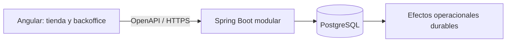

# Tizo Ecommerce

Tizo es un ecommerce con backoffice operacional para cancelar artículos de un pedido multitienda
sin dejar cambios parciales. La entrega cubre compra, solicitud, revisión, aprobación o rechazo,
recálculo del pedido y auditoría.

- **Frontend:** [crisjar3/tizo-ecommerce](https://github.com/crisjar3/tizo-ecommerce).
- **Backend:** [crisjar3/tizo-api](https://github.com/crisjar3/tizo-api).

## Probar la entrega

| Recurso                   | URL                                                                              |
| ------------------------- | -------------------------------------------------------------------------------- |
| Aplicación Angular        | [ecommerce-tizo.netlify.app](https://ecommerce-tizo.netlify.app/)                |
| API REST                  | [d39uqv4p1mtopj.cloudfront.net/api](https://d39uqv4p1mtopj.cloudfront.net/api)   |
| Documentación interactiva | [d39uqv4p1mtopj.cloudfront.net/docs](https://d39uqv4p1mtopj.cloudfront.net/docs) |
| OpenAPI 3.1               | [openapi.yaml](https://d39uqv4p1mtopj.cloudfront.net/openapi/openapi.yaml)       |

No hay credenciales. Para operar el backoffice se selecciona una identidad demo en `/operator`.
El entorno es compartido y no debe recibir datos reales o sensibles.

### Recorrido sugerido: cinco minutos

1. Abrí `/shop`, agregá productos al carrito y completá el checkout.
2. Desde **Mis pedidos**, abrí el pedido y solicitá cancelar una línea.
3. Seleccioná un operador en `/operator` y entrá en `/cancellations`.
4. Aprobá o rechazá la solicitud.
5. Volvé al pedido y verificá líneas, total vigente e historial.

## Cómo funciona la cancelación

1. El cliente u operador selecciona líneas completas y registra un motivo.
2. La API valida pertenencia, estado, versión, despacho y solicitudes superpuestas.
3. La solicitud queda `PENDING`; todavía no cambia el pedido.
4. Operaciones vuelve a validar la información al decidir.
5. Aprobar cancela líneas, restaura inventario, recalcula el total y registra auditoría en una sola
   transacción. Rechazar modifica únicamente la solicitud.
6. Reembolso y notificación se procesan después y no reabren una cancelación efectiva.

Flujo completo: [06-flujos.md](docs/06-flujos.md).

## Respuestas rápidas de diseño

| Pregunta                                                       | Respuesta                                                                                                                                                                                                                                                    |
| -------------------------------------------------------------- | ------------------------------------------------------------------------------------------------------------------------------------------------------------------------------------------------------------------------------------------------------------ |
| ¿Dónde están las máquinas de estado?                           | Pedido, línea, cancelación, solicitud y proyección cliente están en [02-maquinas-de-estado.md](docs/02-maquinas-de-estado.md). En resumen: solo líneas `PENDING` o `PREPARING` son cancelables y una solicitud pasa de `PENDING` a `COMPLETED` o `REJECTED`. |
| ¿Qué evita cancelar después del despacho?                      | La API comprueba `dispatchedAt`, no solo una etiqueta de estado. El hecho de despacho vuelve irreversible la operación.                                                                                                                                      |
| ¿Cómo se evita una operación duplicada?                        | Cada comando usa una clave idempotente. Misma clave y payload devuelve el resultado original; cambiar el payload produce `IDEMPOTENCY_KEY_REUSED`.                                                                                                           |
| ¿Qué pasa si dos operadores deciden a la vez?                  | Locks, versiones esperadas y una única transición terminal permiten un ganador; la operación obsoleta recibe `409`.                                                                                                                                          |
| ¿Cómo funciona el rollback?                                    | Crear, aprobar y rechazar usan transacciones. Si la operación central falla, se revierten líneas, stock, total, solicitud, auditoría e idempotencia. Véase [05-supuestos-y-exclusiones.md](docs/05-supuestos-y-exclusiones.md).                              |
| ¿Qué pasa si falla a mitad por un sistema externo?             | Reembolso y notificación son efectos durables posteriores al commit. Reintentan con backoff y lease; su fallo no revierte la cancelación.                                                                                                                    |
| ¿Qué pasa si el servidor confirma pero la respuesta se pierde? | Angular muestra un resultado incierto y reconcilia por la misma clave antes de repetir el comando.                                                                                                                                                           |
| ¿Qué se audita?                                                | Actor, acción, resultado, fecha, correlación y detalle relevante. No se guardan snapshots completos del agregado.                                                                                                                                            |
| ¿Qué casos límite se contemplan?                               | Estado inválido, despacho concurrente, versión obsoleta, solicitud ya resuelta, líneas superpuestas, doble envío, timeout, offline y fallo de efectos. Reglas completas en [04-reglas-de-negocio.md](docs/04-reglas-de-negocio.md).                          |
| ¿Qué quedó fuera?                                              | Cancelación por cantidad, RBAC real, devoluciones posteriores al despacho, múltiples monedas y consola de remediación manual. Preguntas y exclusiones en [05-supuestos-y-exclusiones.md](docs/05-supuestos-y-exclusiones.md).                                |

## Arquitectura



- Angular organiza catálogo, carrito, pedidos, cancelaciones y operadores por feature. Los DTO se
  generan desde OpenAPI y se transforman antes de llegar a la UI.
- Spring Boot es responsable de reglas, transacciones, concurrencia, idempotencia y auditoría.
- PostgreSQL es la fuente de verdad. MSW se usa solamente para pruebas locales determinísticas.

Más contexto: [operación y dominio](docs/01-operacion-y-dominio.md),
[modelo de datos](docs/03-modelo-de-datos.md) y
[contrato oficial](docs/contracts/tizo.openapi.yaml).

## Criterios de aceptación esenciales

- Una solicitud válida queda `PENDING` sin modificar el pedido.
- Aprobar confirma líneas, stock, total, solicitud, auditoría y efectos de forma atómica.
- Rechazar no modifica líneas, stock ni total.
- Un estado o una versión inválida produce un código estable y ningún cambio parcial.
- Repetir exactamente un comando no duplica pedidos, solicitudes ni decisiones.
- La vista cliente no expone tiendas, hub, versiones ni hechos internos de despacho.

Criterios e invariantes completos: [04-reglas-de-negocio.md](docs/04-reglas-de-negocio.md).

## Ejecutar localmente

Frontend con Node.js `18.20.8` y pnpm `10.34.5`:

```powershell
fnm use 18.20.8
corepack enable
corepack prepare pnpm@10.34.5 --activate
pnpm install --frozen-lockfile
pnpm start
```

`pnpm start` consume la API oficial; `pnpm start:mock` usa datos determinísticos en el navegador.

Backend con Java 21 y Docker, desde el repositorio `tizo-api`:

```powershell
.\mvnw.cmd spring-boot:run
```

## Validación

```powershell
pnpm format:check
pnpm lint
pnpm api:contract:check
pnpm test:ci
pnpm build:mock
pnpm build
pnpm e2e
pnpm e2e:official
```

El frontend cubre unitarias, contrato, flujos E2E mock, accesibilidad, responsive, visuales y un smoke
de lectura contra la API oficial. El backend cubre reglas, persistencia, rollback, idempotencia,
carreras y el journey completo sobre PostgreSQL con Testcontainers.

## Documentación

| Tema                            | Documento                                                           |
| ------------------------------- | ------------------------------------------------------------------- |
| Índice del refinamiento         | [docs/README.md](docs/README.md)                                    |
| Operación y dominio             | [01-operacion-y-dominio.md](docs/01-operacion-y-dominio.md)         |
| Máquinas de estado              | [02-maquinas-de-estado.md](docs/02-maquinas-de-estado.md)           |
| Modelo de datos                 | [03-modelo-de-datos.md](docs/03-modelo-de-datos.md)                 |
| Reglas y criterios              | [04-reglas-de-negocio.md](docs/04-reglas-de-negocio.md)             |
| Supuestos, preguntas y rollback | [05-supuestos-y-exclusiones.md](docs/05-supuestos-y-exclusiones.md) |
| Flujos end-to-end               | [06-flujos.md](docs/06-flujos.md)                                   |
| Contrato OpenAPI                | [tizo.openapi.yaml](docs/contracts/tizo.openapi.yaml)               |

## Limitaciones conocidas

- La identidad demo no reemplaza autenticación ni autorización.
- Reembolso, notificación e inventario externo están simulados.
- El backend usa Maven Wrapper aunque el enunciado pedía Gradle.
- Angular 16 y Node 18 son versiones legadas.

Tiempo aproximado invertido: **pendiente de completar por el autor antes de enviar la entrega**.
