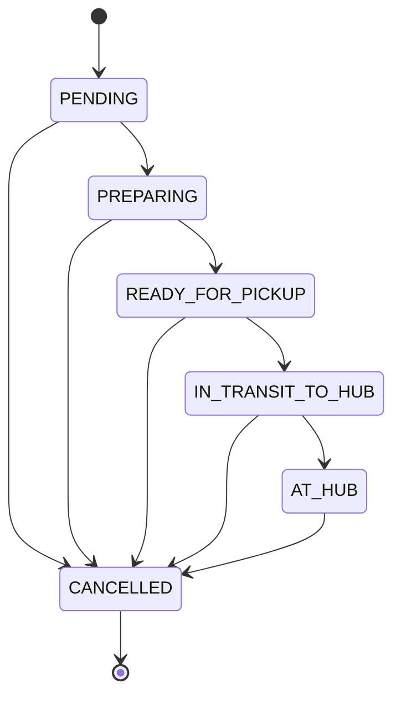

# 02 — Máquinas de estado

## Principio rector

Existe **una sola** máquina de estados: la interna. Lo que ve el cliente es una **proyección**
—una función pura, muchos-a-uno, sin estado propio y sin persistencia.

```
customerView(internalState) → CustomerStatus
```

No se crea una segunda máquina para el cliente. Mantener dos máquinas en sincronía es una
fuente permanente de inconsistencias, y además impide evolucionar la operación sin romper el
contrato externo: si mañana `PREPARING` se divide en `PICKING` y `PACKING`, el cliente sigue
viendo exactamente lo mismo.

---

## `OrderItem` — tramo 1 únicamente

La línea describe **solo** el recorrido tienda → hub. No tiene estado de entrega al cliente,
porque la línea no se entrega: se consolida.

| Estado | Significado | Terminal |
|---|---|---|
| `PENDING` | Pagada. La tienda todavía no la tomó. | No |
| `PREPARING` | La tienda la está preparando. | No |
| `READY_FOR_PICKUP` | Lista en la tienda, esperando retiro hacia el hub. | No |
| `IN_TRANSIT_TO_HUB` | En camino de la tienda al hub. | No |
| `AT_HUB` | Recibida y verificada en el centro de consolidación. | No |
| `CANCELLED` | Anulada por Operaciones. | **Sí** |



Toda línea no cancelada puede cancelarse mientras `order.dispatched_at IS NULL` **y** la orden no
tenga una cancelación efectiva previa (RN-26). Ambas condiciones de bloqueo viven en la orden,
no en la línea.

> **La condición se evalúa contra el timestamp, nunca contra `fulfillment_status`.** Escribirla
> como `fulfillment_status != DISPATCHED` dejaría pasar una orden `DELIVERED`, porque el estado
> sigue avanzando después del despacho. `dispatched_at` es monótono: una vez seteado no vuelve
> a ser nulo, y cubre todo lo que ocurra después del punto de no retorno sin necesidad de
> enumerar estados.

---

## `Order` — dos ejes ortogonales

Una orden puede estar despachada y parcialmente cancelada al mismo tiempo. Con un único enum
esa combinación no se puede expresar sin explotar en estados compuestos. Por eso son dos ejes
independientes.

### Eje 1 — `fulfillmentStatus` (dónde está físicamente)

| Estado | Regla de derivación |
|---|---|
| `AWAITING_STORES` | Alguna línea viva todavía no está en `AT_HUB`. |
| `READY_TO_DISPATCH` | Todas las líneas vivas están en `AT_HUB`. |
| `DISPATCHED` | `dispatched_at` no es nulo. |
| `DELIVERED` | `delivered_at` no es nulo. |

> Las líneas canceladas **se excluyen** del cálculo. Consecuencia deliberada: cancelar
> justamente la línea más atrasada puede hacer avanzar la orden a `READY_TO_DISPATCH`.

### Eje 2 — `cancellationStatus` (qué sigue en pie)

| Estado | Regla de derivación |
|---|---|
| `NONE` | Ninguna línea cancelada. |
| `PARTIAL` | Al menos una cancelada y al menos una viva. |
| `FULL` | Todas las líneas canceladas. |

### El pago no es un estado

La orden entra al alcance **ya pagada**. Un enum con un único valor posible no aporta
información. El pago se modela como hecho, no como estado: `paid_at` y `paid_amount_cents`,
ambos siempre presentes.

Además, un enum que mezclara `PAID` con `CANCELLED` no podría expresar *"orden pagada y
totalmente cancelada"*, que es una situación real y frecuente: el dinero entró igual.

### Matriz de combinaciones

| `fulfillmentStatus` | `cancellationStatus` | ¿Válido? | Nota |
|---|---|---|---|
| `AWAITING_STORES` | `NONE` | Sí | Caso inicial. |
| `AWAITING_STORES` | `PARTIAL` | Sí | Cancelación temprana. |
| `AWAITING_STORES` | `FULL` | Sí | Orden anulada por completo. |
| `READY_TO_DISPATCH` | `NONE` | Sí | Todo llegó al hub. |
| `READY_TO_DISPATCH` | `PARTIAL` | Sí | Lo que queda vivo está listo. |
| `READY_TO_DISPATCH` | `FULL` | **No** | Sin líneas vivas no hay nada que despachar. |
| `DISPATCHED` | `PARTIAL` | Sí | Se despachó lo que quedó. |
| `DISPATCHED` | `FULL` | **No** | Invariante: no se despacha una orden vacía. |
| `DELIVERED` | `PARTIAL` | Sí | **Caso final más frecuente.** |

Las dos filas imposibles son invariantes verificables y deben cubrirse con tests.

---

## Cancelabilidad por estado de orden

> ⚠️ **Esta sección es documentación, no especificación.** La regla se evalúa contra
> `dispatched_at IS NULL` (RN-01). Las tablas de abajo son la **consecuencia observable** de esa
> regla, útiles para la UI y para Operaciones. Implementar la validación a partir de estas
> tablas reintroduce exactamente el error que RN-01 evita.

### Por `fulfillmentStatus`

| Estado | ¿Se puede cancelar? | Motivo |
|---|---|---|
| `AWAITING_STORES` | ✅ Sí | `dispatched_at` nulo. Nada salió del hub. |
| `READY_TO_DISPATCH` | ✅ Sí | `dispatched_at` nulo. El paquete está armado pero **no salió**. |
| `DISPATCHED` | ❌ No | `dispatched_at` seteado. Punto de no retorno superado. |
| `DELIVERED` | ❌ No | `dispatched_at` sigue seteado. Sería una devolución. |

**`READY_TO_DISPATCH` es el caso que más se malinterpreta.** Todas las líneas están en el hub y
el paquete está armado: es la cancelación **más cara** de todas, porque hay que desarmar el
consolidado y devolver el producto a su tienda. Pero sigue siendo perfectamente válida.

La ventana no se cierra por costo, se cierra por **irreversibilidad física**. Mientras el
paquete no salga, lo que ocurre adentro del hub es logística interna que el cliente nunca ve.

### Por `cancellationStatus`

| Estado | ¿Se puede cancelar? | Motivo |
|---|---|---|
| `NONE` | ✅ Sí | La orden no usó todavía su única cancelación. |
| `PARTIAL` | ❌ No | Ya hubo una cancelación efectiva → `ORDER_ALREADY_HAS_CANCELLATION`. |
| `FULL` | ❌ No | Ídem, y además no quedan líneas vivas. |

**Una orden admite una sola cancelación efectiva (RN-26).** Puede abarcar varias líneas de
varias tiendas en una misma operación, pero una vez efectivizada la orden queda cerrada para
nuevas cancelaciones. `PARTIAL` **es terminal** en términos de cancelabilidad, aunque queden
líneas vivas avanzando hacia el hub.

> La validación no se hace contra este campo —que es derivado— sino contra la existencia de una
> `cancellation_request` en estado `APPROVED` o `COMPLETED`. Ver RN-26.

### Matriz combinada

| `fulfillmentStatus` | `cancellationStatus` | ¿Cancelable? | Resultado |
|---|---|---|---|
| `AWAITING_STORES` | `NONE` | ✅ | Caso habitual. |
| `AWAITING_STORES` | `PARTIAL` | ❌ | `ORDER_ALREADY_HAS_CANCELLATION` |
| `AWAITING_STORES` | `FULL` | ❌ | `ORDER_ALREADY_HAS_CANCELLATION` |
| `READY_TO_DISPATCH` | `NONE` | ✅ | Efecto `RETURN_TO_STORE`, el más costoso. |
| `READY_TO_DISPATCH` | `PARTIAL` | ❌ | `ORDER_ALREADY_HAS_CANCELLATION` |
| `DISPATCHED` | `NONE` | ❌ | `ORDER_ALREADY_DISPATCHED` |
| `DISPATCHED` | `PARTIAL` | ❌ | `ORDER_ALREADY_DISPATCHED` |
| `DELIVERED` | `NONE` | ❌ | `ORDER_ALREADY_DISPATCHED` |
| `DELIVERED` | `PARTIAL` | ❌ | `ORDER_ALREADY_DISPATCHED` |

En la práctica **solo dos combinaciones son cancelables**, ambas con `cancellationStatus = NONE`.
La regla completa se lee en una línea:

> Cancelable ⟺ el paquete no salió **y** la orden no gastó todavía su cancelación.

Los tres motivos de rechazo son distintos y **no intercambiables**:

| Rechazo | Significa |
|---|---|
| `ORDER_ALREADY_DISPATCHED` | Llegaste tarde: el paquete ya salió. |
| `ORDER_ALREADY_HAS_CANCELLATION` | Ya se usó la única cancelación de esta orden. |
| `NO_CANCELLABLE_ITEMS` | No hay material sobre el cual operar. |

Devolver el mismo error para los tres le arruina el diagnóstico a Operaciones: son problemas
distintos y habilitan acciones distintas.

### Uso en la interfaz

La UI puede usar estas tablas para habilitar o deshabilitar el botón de cancelar y evitarle a
Operaciones un intento condenado al fracaso.

**Eso no reemplaza la validación del backend.** La UI puede estar desactualizada, el estado
puede cambiar entre la carga de la pantalla y el clic, y la API es invocable directamente. El
backend valida siempre, aunque la UI ya haya validado.

---

## `CancellationRequest` — el registro operativo

| Estado | Significado | ¿Consume la cancelación de la orden? | Terminal |
|---|---|---|---|
| `REQUESTED` | Solicitud creada, todavía sin ejecutar. | No | No |
| `APPROVED` | Validada; las líneas quedaron marcadas como canceladas. | **Sí** | No |
| `COMPLETED` | Operación cerrada y auditada. | **Sí** | **Sí** |
| `REJECTED` | Rechazada por regla de negocio. Nada cambió. | No (RN-27) | **Sí** |

**Una orden tiene como máximo una solicitud efectiva.** Puede acumular varias `REJECTED` —cada
intento fallido queda registrado para auditoría— pero solo una llega a `APPROVED`/`COMPLETED`.
Un rechazo no gasta la cancelación.

En este alcance no hay reembolso, por lo que no existen los estados `REFUND_PENDING` ni
`FAILED`: sin sistemas externos, la transacción es atómica y no puede quedar a mitad de camino.

Este agregado es **invisible para el cliente**. El cliente ve el efecto —su línea cancelada—,
no la solicitud que lo produjo.

---

## Proyección al cliente

El cliente ve **un solo estado por orden**. Ni el hub, ni las tiendas, ni los estados por línea
son visibles.

### Estado de la orden

| Condición interna | Ve el cliente |
|---|---|
| `cancellationStatus = FULL` | Cancelado |
| `AWAITING_STORES` / `READY_TO_DISPATCH` | Preparando tu pedido |
| `DISPATCHED` | En camino |
| `DELIVERED` | Entregado |

`cancellationStatus = FULL` tiene prioridad sobre cualquier estado de fulfillment.

### La excepción que sí se muestra

Los **estados** por línea se ocultan. El **hecho de que una línea fue cancelada** no.

Son cosas distintas: uno es telemetría operativa que al cliente no le aporta nada; el otro es
un cambio en lo que va a recibir y en lo que se le va a cobrar. Ocultarlo no simplifica, esconde.

```
Pedido #1234 — Completado
  ✅ Zapatillas running        Entregado
  ✅ Medias deportivas x3      Entregado
  ❌ Campera impermeable       Cancelado
```

### Reglas de la proyección

1. **No se persiste.** Es derivada. Persistirla crea dos fuentes de verdad que se separan.
2. **Se calcula en el backend.** Si se calculara en el frontend, cada canal —web, móvil, mail,
   notificaciones— reimplementaría el mapeo con su propio criterio.
3. **El endpoint de cliente no devuelve el estado interno.** Ni siquiera de más en el payload:
   si viaja, alguien terminará mostrándolo.
4. **Las etiquetas son copy, no enums.** Viven en un diccionario de i18n. Cambiar "Preparando
   tu pedido" no debe requerir tocar el dominio ni una migración.
