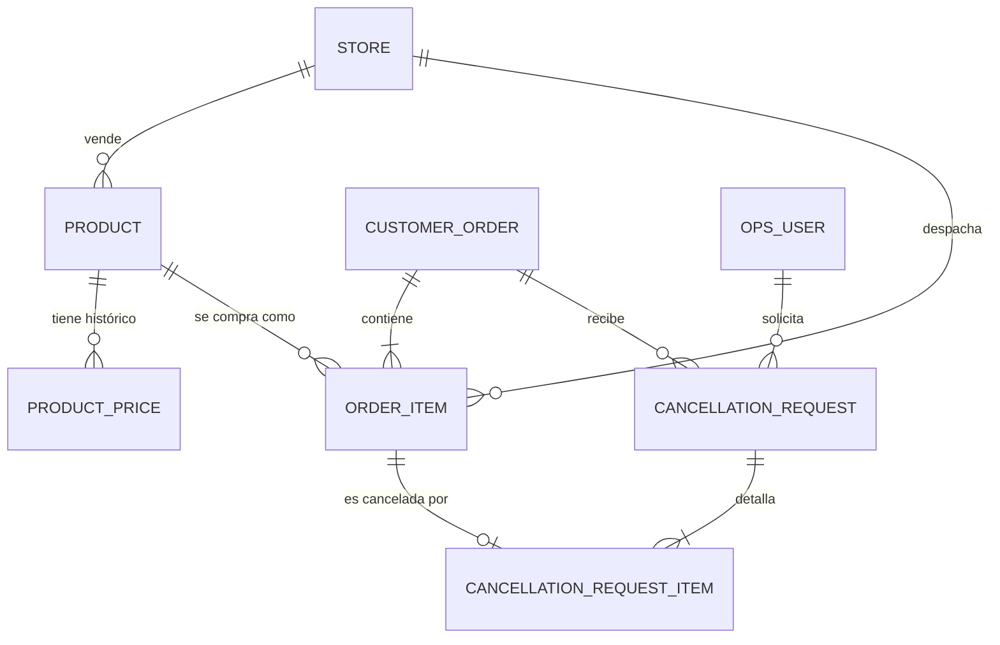

# 03 — Modelo de datos

## Convenciones

| Aspecto | Decisión | Motivo |
|---|---|---|
| Identificadores | `UUID` | Generables en cliente, sin colisión entre entornos. |
| Montos | `BIGINT` en **centavos**, sufijo `_cents` | Exactitud garantizada. Nunca punto flotante. |
| Moneda | `CHAR(3)` ISO-4217 a nivel orden | Una orden no mezcla monedas. |
| Enums | `VARCHAR` + `CHECK` | Portable entre H2, PostgreSQL y MySQL. |
| Fechas | `TIMESTAMP` en UTC | Sin ambigüedad de zona horaria. |
| Concurrencia | Columna `version` (optimistic locking) | Evita cancelaciones concurrentes inconsistentes. |

> **Sobre los montos:** los cálculos de prorrateo se hacen en enteros y el residuo del redondeo
> se asigna a la línea de mayor monto, de modo que la suma de las partes siempre coincida con
> el total. En Java, un Value Object `Money` envuelve el `long` y bloquea la aritmética suelta.

---

## Diagrama



`AUDIT_LOG` no aparece en el diagrama: se relaciona con todos los agregados por
`aggregate_type` + `aggregate_id`, sin claves foráneas, para no acoplar la auditoría al modelo.

---

## Catálogo (contexto, fuera del núcleo)

### `store`

| Columna | Tipo | Notas |
|---|---|---|
| `id` | UUID PK | |
| `name` | VARCHAR(160) | |
| `status` | VARCHAR(24) | `ACTIVE` \| `SUSPENDED` |
| `commission_rate_bps` | INT | Comisión del marketplace en *basis points* (750 = 7,5 %). |

Entero en *basis points* en lugar de decimal: evita errores de redondeo en el cálculo de comisión.

### `product`

| Columna | Tipo | Notas |
|---|---|---|
| `id` | UUID PK | |
| `store_id` | UUID FK → `store` | |
| `sku` | VARCHAR(64) | Único por tienda. |
| `name` | VARCHAR(240) | |
| `status` | VARCHAR(24) | `ACTIVE` \| `DISCONTINUED` |

### `product_price`

| Columna | Tipo | Notas |
|---|---|---|
| `id` | UUID PK | |
| `product_id` | UUID FK → `product` | |
| `amount_cents` | BIGINT | |
| `currency` | CHAR(3) | |
| `valid_from` | TIMESTAMP | |
| `valid_to` | TIMESTAMP NULL | Nulo = vigente. |

> **Esta tabla nunca se consulta durante una cancelación.** Existe para el catálogo. Una vez
> creada la orden, el precio vigente es el **congelado en la línea**. Leer el catálogo al
> cancelar reescribiría la historia: si el producto cambió de precio, se devolvería un monto
> distinto del que se cobró.

---

## Órdenes (núcleo)

### `customer_order`

`order` es palabra reservada en SQL, de ahí el nombre.

| Columna | Tipo | Notas |
|---|---|---|
| `id` | UUID PK | |
| `customer_id` | UUID | |
| `currency` | CHAR(3) | |
| **Pago (inmutable)** | | |
| `paid_at` | TIMESTAMP NOT NULL | Precondición del alcance. |
| `paid_amount_cents` | BIGINT NOT NULL | Lo efectivamente cobrado. Nunca se modifica. |
| **Totales originales (inmutables)** | | |
| `subtotal_cents` | BIGINT | Suma de subtotales de línea. |
| `discount_cents` | BIGINT | Descuento a nivel orden, ya prorrateado en las líneas. |
| `shipping_cents` | BIGINT | Envío del paquete consolidado. |
| `tax_cents` | BIGINT | IVA total. |
| `grand_total_cents` | BIGINT | Debe coincidir con `paid_amount_cents`. |
| **Montos vigentes (derivados)** | | |
| `cancelled_amount_cents` | BIGINT DEFAULT 0 | Suma de las líneas canceladas. |
| `active_amount_cents` | BIGINT | `paid_amount_cents - cancelled_amount_cents`. |
| **Estado** | | |
| `fulfillment_status` | VARCHAR(32) | `AWAITING_STORES` \| `READY_TO_DISPATCH` \| `DISPATCHED` \| `DELIVERED` |
| `cancellation_status` | VARCHAR(16) | `NONE` \| `PARTIAL` \| `FULL` |
| `dispatched_at` | TIMESTAMP NULL | **No nulo = punto de no retorno.** |
| `delivered_at` | TIMESTAMP NULL | |
| **Control** | | |
| `created_at`, `updated_at` | TIMESTAMP | |
| `version` | BIGINT | Optimistic locking. |

**Por qué dos conjuntos de totales.** Los originales son un hecho histórico: lo que se cobró.
Los vigentes son el resultado de las cancelaciones. Mezclarlos impide responder "¿cuánto se
cobró?" después de la primera cancelación, que es justamente lo que la auditoría necesita.

`fulfillment_status` y `cancellation_status` son **derivados y materializados**: se recalculan
al cierre de cada transición de línea. Se persisten solo para poder filtrar e indexar, nunca se
asignan directamente desde fuera del dominio.

### `order_item`

| Columna | Tipo | Notas |
|---|---|---|
| `id` | UUID PK | |
| `order_id` | UUID FK → `customer_order` | |
| `store_id` | UUID FK → `store` | |
| `product_id` | UUID FK → `product` | |
| **Snapshot de catálogo** | | |
| `product_name` | VARCHAR(240) | Copiado al crear la orden. |
| `product_sku` | VARCHAR(64) | Copiado al crear la orden. |
| **Cantidad y montos (congelados)** | | |
| `quantity` | INT NOT NULL | **Inmutable.** No existe cancelación parcial de cantidad. |
| `unit_price_cents` | BIGINT | |
| `line_subtotal_cents` | BIGINT | `unit_price_cents × quantity` |
| `line_discount_cents` | BIGINT | Porción prorrateada del descuento de orden. |
| `line_tax_cents` | BIGINT | IVA de la línea. |
| `line_shipping_cents` | BIGINT | Porción prorrateada del envío. **No forma parte de `line_total_cents`.** |
| `line_total_cents` | BIGINT | `subtotal − discount + tax`, **sin envío**. Monto afectado al cancelar. |
| `commission_cents` | BIGINT | Comisión del marketplace sobre esta línea. |
| **Estado** | | |
| `fulfillment_status` | VARCHAR(32) | Estados del tramo 1 + `CANCELLED`. |
| `cancelled_at` | TIMESTAMP NULL | |
| `version` | BIGINT | |

**Por qué el envío queda fuera de `line_total_cents`.** Existe un único envío consolidado. Si se
cancela una línea pero queda alguna viva, el paquete sale igual y el costo de envío se incurre
igual: no hay nada que liberar. El envío solo se considera afectado cuando se cancela la orden
completa. Mantenerlo fuera del total de línea hace que esa regla sea aritmética, no condicional.

**Los snapshots no son redundancia.** Si el producto se renombra, se descataloga o la tienda se
da de baja, la orden histórica debe seguir mostrando lo que el cliente compró. Sin snapshot, un
`JOIN` contra el catálogo cambia el pasado.

---

## Cancelación

### `cancellation_request`

| Columna | Tipo | Notas |
|---|---|---|
| `id` | UUID PK | |
| `order_id` | UUID FK → `customer_order` | |
| `requested_by` | UUID FK → `ops_user` | Quién. |
| `requested_at` | TIMESTAMP | Cuándo. |
| `reason_code` | VARCHAR(48) | `OUT_OF_STOCK` \| `CUSTOMER_REQUEST` \| `STORE_UNABLE` \| `PRICING_ERROR` \| `FRAUD_SUSPICION` \| `OTHER` |
| `reason_note` | TEXT NULL | Obligatoria si `reason_code = OTHER`. |
| `status` | VARCHAR(24) | `REQUESTED` \| `APPROVED` \| `COMPLETED` \| `REJECTED` |
| `rejection_code` | VARCHAR(48) NULL | `ORDER_ALREADY_DISPATCHED` \| `ORDER_ALREADY_HAS_CANCELLATION` \| `NO_CANCELLABLE_ITEMS`. Presente solo si `REJECTED`. |
| `idempotency_key` | VARCHAR(64) UNIQUE | Enviada por el cliente. Distingue un reintento de un segundo intento. |
| `effective_order_id` | UUID NULL UNIQUE | Copia de `order_id`, seteada **solo** al efectivizarse. Ver abajo. |
| `total_cancelled_cents` | BIGINT | Suma congelada de las líneas afectadas. |
| `correlation_id` | UUID | Enlaza todos los eventos de auditoría de esta operación. |
| `completed_at` | TIMESTAMP NULL | |
| `version` | BIGINT | |

Un `reason_code` acotado en lugar de texto libre permite medir *por qué* se cancela. Un campo
de texto libre no se puede agregar ni graficar.

**`effective_order_id` — cómo se garantiza "una sola cancelación por orden" (RN-26).**

Una orden puede acumular varias solicitudes `REJECTED`, pero solo una efectiva. Un índice único
sobre `order_id` sería demasiado estricto: bloquearía tras el primer rechazo, violando RN-27.

La solución es una columna que **solo tiene valor cuando la solicitud se efectiviza**:

```
status = APPROVED | COMPLETED  →  effective_order_id = order_id
status = REQUESTED | REJECTED  →  effective_order_id = NULL
```

Con `UNIQUE` sobre esa columna, dos solicitudes efectivas de la misma orden colisionan, mientras
que múltiples `NULL` conviven sin problema —el estándar SQL no considera dos `NULL` iguales a
efectos de unicidad—. Es portable entre H2, PostgreSQL y MySQL, a diferencia de un índice
parcial con `WHERE`.

La validación de aplicación sigue siendo la primera línea de defensa; este índice es la garantía
que sobrevive a una condición de carrera.

**`idempotency_key` — reintento contra segundo intento.**

Sin esta columna, un doble clic o un retry por timeout llegaría como una segunda solicitud y
sería rechazado con `ORDER_ALREADY_HAS_CANCELLATION`, confundiendo al operador con un error que
no cometió. Con ella, la misma clave devuelve el resultado original (RN-28) y solo una clave
nueva cuenta como segundo intento (RN-26).

### `cancellation_request_item`

| Columna | Tipo | Notas |
|---|---|---|
| `id` | UUID PK | |
| `cancellation_request_id` | UUID FK | |
| `order_item_id` | UUID FK → `order_item` | Único por solicitud. |
| `item_status_before` | VARCHAR(32) | Estado de la línea **al momento** de cancelar. |
| `cancelled_amount_cents` | BIGINT | Copia congelada de `line_total_cents`. |
| `operational_effect` | VARCHAR(40) | `NO_ACTION` \| `STOP_PREPARATION` \| `RELEASE_STOCK` \| `INTERCEPT_AT_HUB` \| `RETURN_TO_STORE` |

`operational_effect` materializa la tabla de efectos del documento 01. Es la instrucción concreta
que tienda y hub reciben, y se calcula una sola vez a partir de `item_status_before`.

---

## Auditoría

### `audit_log`

| Columna | Tipo | Notas |
|---|---|---|
| `id` | UUID PK | |
| `aggregate_type` | VARCHAR(48) | `ORDER` \| `ORDER_ITEM` \| `CANCELLATION_REQUEST` |
| `aggregate_id` | UUID | Sin FK, deliberadamente. |
| `event_type` | VARCHAR(64) | Ver lista abajo. |
| `actor_id` | UUID NULL | Nulo en eventos de sistema. |
| `actor_role` | VARCHAR(24) | `OPS` \| `SYSTEM` |
| `occurred_at` | TIMESTAMP | |
| `payload_before` | JSON/TEXT | Estado previo de los campos afectados. |
| `payload_after` | JSON/TEXT | Estado posterior. |
| `correlation_id` | UUID | Compartido por toda la operación. |

**Append-only.** Sin `UPDATE`, sin `DELETE`. Una auditoría editable no es auditoría. Se refuerza
revocando permisos en base de datos y con un test que lo verifique.

**El `correlation_id` es lo que la hace utilizable.** Sin él quedan filas sueltas y ninguna forma
de reconstruir qué ocurrió en una cancelación concreta.

Eventos emitidos en una cancelación, todos con el mismo `correlation_id`:

```
CANCELLATION_REQUESTED
ORDER_ITEM_CANCELLED          (uno por línea afectada)
ORDER_AMOUNTS_RECALCULATED
ORDER_STATUS_RECALCULATED
CANCELLATION_COMPLETED
```

> **No se usa event sourcing.** Es tentador y desproporcionado para este alcance. El estado
> actual vive en tablas normales y el log de auditoría corre en paralelo.

### `ops_user`

| Columna | Tipo | Notas |
|---|---|---|
| `id` | UUID PK | |
| `name` | VARCHAR(160) | |
| `email` | VARCHAR(240) | |
| `role` | VARCHAR(24) | `OPS` \| `OPS_SUPERVISOR` |

Mínimo indispensable para trazar quién ejecuta. `OPS_SUPERVISOR` queda declarado pero sin
privilegios diferenciados en este alcance.

---

## Índices sugeridos

| Tabla | Índice | Para qué |
|---|---|---|
| `order_item` | `(order_id, fulfillment_status)` | Derivar estados de orden. |
| `order_item` | `(store_id, fulfillment_status)` | Vista operativa por tienda. |
| `cancellation_request` | `(order_id, requested_at DESC)` | Historial de la orden, incluidos los rechazos. |
| `cancellation_request` | `(effective_order_id)` UNIQUE | **Garantiza una sola cancelación efectiva por orden (RN-26).** |
| `cancellation_request` | `(idempotency_key)` UNIQUE | Distingue reintento de segundo intento (RN-28). |
| `cancellation_request_item` | `(order_item_id)` UNIQUE | **Impide cancelar dos veces la misma línea.** |
| `audit_log` | `(correlation_id)` | Reconstruir una operación. |
| `audit_log` | `(aggregate_type, aggregate_id, occurred_at DESC)` | Historial de un agregado. |

Los tres índices únicos no son optimizaciones: son **invariantes de negocio expresadas en el
esquema**, la última línea de defensa si la validación de aplicación falla bajo concurrencia.
Una regla que solo vive en el código se puede saltear; una que vive en el esquema, no.
