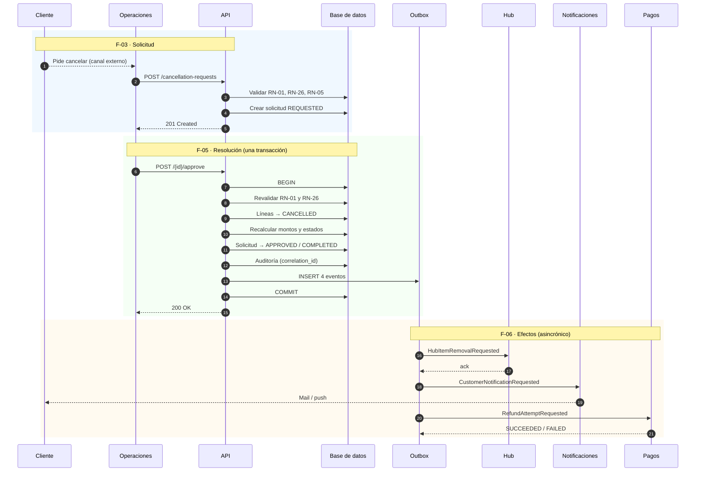

# 06 — Flujos

Flujos de usuario y de sistema, con su recorrido visual, sus efectos y sus errores.

## Cómo leer este documento

Cada flujo lleva una marca de alcance:

| Marca | Significado |
|---|---|
| 🟢 **SLICE** | Se implementa en la entrega. |
| 🟡 **PARCIAL** | Se implementa el mecanismo; el disparador real queda documentado. |
| ⚪ **DOCUMENTADO** | Diseñado y especificado, **no construido**. |

El diseño completo está acá para que la solución se lea como un sistema, no como un endpoint
suelto. Lo que no se construye está señalado sin ambigüedad.

---

## Mapa de flujos

| ID | Flujo | Actor | Alcance |
|---|---|---|---|
| **F-01** | Listar órdenes | Operaciones | 🟢 SLICE |
| **F-02** | Ver detalle de una orden | Operaciones | 🟢 SLICE |
| **F-03** | Solicitar cancelación de productos | Operaciones · *(Cliente a futuro)* | 🟡 PARCIAL |
| **F-04** | Bandeja de solicitudes de cancelación | Operaciones | 🟢 SLICE |
| **F-05** | Resolver una solicitud (aceptar / rechazar) | Operaciones | 🟢 SLICE |
| **F-06** | Propagación de efectos posteriores | Sistema | ⚪ DOCUMENTADO |
| **F-07** | Vista de la orden por el cliente | Cliente | ⚪ DOCUMENTADO |

## Superficies

| Superficie | Quién entra | Qué ve |
|---|---|---|
| **Backoffice** | `OPS` autenticado | Estados internos completos, montos, tiendas, hub. |
| **Portal del cliente** | Cliente | Estado proyectado único. Nunca el hub ni los estados por línea. |

---

# F-01 · Listar órdenes 🟢

**Objetivo.** Que Operaciones encuentre la orden sobre la que necesita trabajar.

### Pantalla

```
┌──────────────────────────────────────────────────────────────────────┐
│  Órdenes                                                             │
│  ┌────────────────────────────────────────────────────────────────┐  │
│  │ 🔎 Buscar por N° de orden o cliente                            │  │
│  └────────────────────────────────────────────────────────────────┘  │
│  Estado: [ Todos ▾ ]   Cancelación: [ Todas ▾ ]                      │
│                                                                      │
│  N° ORDEN    CLIENTE        TIENDAS  TOTAL      ESTADO         CANC. │
│  ─────────────────────────────────────────────────────────────────── │
│  #1042       M. Duarte          3    $128.400   Esperando      —     │
│                                                 tiendas              │
│  #1041       J. Pereyra         2    $ 54.900   Listo para    Parcial│
│                                                 despachar            │
│  #1039       L. Gómez           1    $ 22.100   Despachado     —     │
│  #1038       C. Ibáñez          2    $ 89.750   Entregado     Parcial│
│                                                                      │
│                                              ‹ 1 2 3 ›               │
└──────────────────────────────────────────────────────────────────────┘
```

### Qué sucede

| # | Paso |
|---|---|
| 1 | El operador entra a la pantalla. |
| 2 | El frontend pide `GET /api/ops/orders?status=&cancellation=&page=` |
| 3 | El backend devuelve la página con **estados internos** (F-01 vive en backoffice). |
| 4 | La tabla muestra `fulfillmentStatus` y `cancellationStatus` en columnas separadas. |

### Efectos

Ninguno. Es una lectura pura, sin escritura en auditoría.

### Detalles que importan

- **Dos columnas, no una.** `fulfillmentStatus` y `cancellationStatus` son ejes ortogonales
  (doc 02). Fusionarlos en una sola columna obliga a inventar etiquetas compuestas.
- **Se muestran los totales originales**, no los vigentes. El operador busca la orden por lo que
  el cliente pagó, que es lo que el cliente le va a decir por teléfono.

---

# F-02 · Ver detalle de una orden 🟢

**Objetivo.** Entender el estado real de cada línea y decidir si corresponde cancelar.

### Pantalla

```
┌──────────────────────────────────────────────────────────────────────┐
│  ‹ Volver          Orden #1042 · M. Duarte                           │
│                                                                      │
│  Pagada el 03/08 · $128.400 · Esperando tiendas · Sin cancelaciones   │
│                                                                      │
│  PRODUCTO              TIENDA        CANT   TOTAL      ESTADO        │
│  ─────────────────────────────────────────────────────────────────── │
│  Zapatillas running    RunStore        1   $ 72.000   En el hub      │
│  Medias deportivas x3  RunStore        3   $ 12.400   En el hub      │
│  Campera impermeable   OutdoorMax      1   $ 44.000   Preparando     │
│                                                                      │
│  ┌────────────────────────────────────────────────────────────────┐  │
│  │ ⚠️  El paquete no puede salir hasta que OutdoorMax entregue.    │  │
│  └────────────────────────────────────────────────────────────────┘  │
│                                                                      │
│  Subtotal   $118.400   Envío  $10.000   Total  $128.400              │
│                                                                      │
│                             [ Solicitar cancelación de productos ]   │
└──────────────────────────────────────────────────────────────────────┘
```

### Qué sucede

| # | Paso |
|---|---|
| 1 | `GET /api/ops/orders/{id}` devuelve orden, líneas, montos y estados internos. |
| 2 | La UI evalúa cancelabilidad (doc 02) y habilita o deshabilita el botón. |
| 3 | Si la orden no es cancelable, el botón queda inhabilitado **con el motivo visible**. |

### Estados del botón

| Situación | Botón | Mensaje |
|---|---|---|
| Cancelable | Habilitado | — |
| `dispatched_at` no nulo | Deshabilitado | "El paquete ya fue despachado. Corresponde una devolución." |
| Cancelación efectiva previa | Deshabilitado | "Esta orden ya tuvo su cancelación." |

> La UI valida para **ahorrarle a Operaciones un intento condenado**. No reemplaza la validación
> del backend: la pantalla puede estar desactualizada y la API es invocable directamente.

### Efectos

Ninguno. Lectura pura.

---

# F-03 · Solicitar cancelación de productos 🟡

**Objetivo.** Crear una solicitud de cancelación sobre una o más líneas.

> **Alcance.** El mecanismo se implementa completo. En el slice lo dispara **Operaciones** desde
> el backoffice. El mismo endpoint queda preparado para que en el futuro lo invoque el
> **cliente** desde su portal: cambia quién autentica, no la lógica.

### Pantalla

```
┌──────────────────────────────────────────────────────────────────────┐
│  Solicitar cancelación · Orden #1042                                 │
│                                                                      │
│  ┌────────────────────────────────────────────────────────────────┐  │
│  │ ⚠️  Esta orden admite UNA SOLA cancelación.                     │  │
│  │    Seleccioná ahora todos los productos a cancelar.            │  │
│  │    No vas a poder volver a cancelar más tarde.                 │  │
│  └────────────────────────────────────────────────────────────────┘  │
│                                                                      │
│  ☐  Zapatillas running     RunStore      $ 72.000   En el hub        │
│  ☐  Medias deportivas x3   RunStore      $ 12.400   En el hub        │
│  ☑  Campera impermeable    OutdoorMax    $ 44.000   Preparando       │
│                                                                      │
│  Motivo *  [ Sin stock en tienda            ▾ ]                      │
│  Nota      [                                   ]                     │
│                                                                      │
│  ─────────────────────────────────────────────────────────────────── │
│  Seleccionado: 1 producto · Monto afectado: $44.000                  │
│                                                                      │
│                                    [ Cancelar ]  [ Confirmar ]       │
└──────────────────────────────────────────────────────────────────────┘
```

### Qué sucede

| # | Paso | Detalle |
|---|---|---|
| 1 | El operador marca líneas y elige motivo. | La UI calcula el monto afectado en vivo, **sumando `line_total_cents`** (sin envío). |
| 2 | Confirma. | La UI genera una `idempotency_key` **al abrir la pantalla**, no al hacer clic. |
| 3 | `POST /api/ops/cancellation-requests` | Body: `orderId`, `itemIds[]`, `reasonCode`, `reasonNote`, `idempotencyKey`. |
| 4 | El backend valida en el orden de RN-01 → RN-26 → RN-05. | Ver doc 04, *Orden de validación*. |
| 5 | Crea la solicitud en `REQUESTED`. | **Todavía no cancela nada.** |
| 6 | Emite `CANCELLATION_REQUESTED` a auditoría. | Con `correlation_id` nuevo. |

### Efectos

| Efecto | Cuándo |
|---|---|
| `cancellation_request` creada en `REQUESTED` | Siempre que valide |
| `cancellation_request_item` por línea, con `item_status_before` y `operational_effect` congelados | Siempre |
| Evento de auditoría `CANCELLATION_REQUESTED` | Siempre |
| **Las líneas NO cambian de estado** | — |
| **Los montos de la orden NO se recalculan** | — |

> **Por qué la solicitud no cancela nada todavía.** Separar *pedir* de *resolver* es lo que
> permite que mañana el cliente sea quien pida sin darle poder de escritura sobre el dominio.
> En el slice ambos pasos los hace el mismo operador, pero el modelo ya soporta dos actores.

### Errores

| Situación | Respuesta | Qué ve el operador |
|---|---|---|
| Misma `idempotency_key` | `200` con el resultado original | La solicitud ya creada. Sin duplicados. |
| Sin motivo | `400 VALIDATION_ERROR` | Campo marcado en rojo. |
| Orden despachada | `409 ORDER_ALREADY_DISPATCHED` | "El paquete ya salió. Corresponde una devolución." |
| Cancelación previa | `409 ORDER_ALREADY_HAS_CANCELLATION` | "Esta orden ya tuvo su cancelación." |
| Ninguna línea válida | `409 NO_CANCELLABLE_ITEMS` | "No hay productos cancelables." |

> **La `idempotency_key` se genera al abrir la pantalla.** Si se generara en el clic, cada clic
> produciría una clave distinta y el doble clic se leería como segundo intento —el error que
> RN-28 existe para evitar—.

---

# F-04 · Bandeja de solicitudes 🟢

**Objetivo.** Que Operaciones vea qué solicitudes esperan resolución.

### Pantalla

```
┌──────────────────────────────────────────────────────────────────────┐
│  Solicitudes de cancelación                                          │
│  [ Pendientes ]  Resueltas    Rechazadas                             │
│                                                                      │
│  SOLICITUD  ORDEN   PRODUCTOS  MONTO      MOTIVO         SOLICITADA  │
│  ─────────────────────────────────────────────────────────────────── │
│  #C-207     #1042      1       $ 44.000   Sin stock      hace 4 min  │
│  #C-206     #1040      2       $ 31.200   Pedido del     hace 22 min │
│                                            cliente                   │
│  #C-205     #1037      1       $  8.900   Error de       hace 1 h    │
│                                            precio                    │
│                                                                      │
│  ⚠️ #C-204   #1035      1       $ 15.000   Sin stock      hace 3 h    │
│     El paquete de esta orden fue despachado hace 20 min.             │
└──────────────────────────────────────────────────────────────────────┘
```

### Qué sucede

| # | Paso |
|---|---|
| 1 | `GET /api/ops/cancellation-requests?status=REQUESTED` |
| 2 | Por cada solicitud, el backend **reevalúa la cancelabilidad al momento de la consulta**. |
| 3 | Las que dejaron de ser válidas se marcan con advertencia visible. |

### El detalle que evita el peor bug de esta pantalla

**La validez se reevalúa al listar, no se lee de la solicitud.**

Entre que una solicitud se crea y alguien la resuelve pasa tiempo real. En ese lapso el paquete
puede haber sido despachado. Una bandeja que muestra "pendiente" sin revalidar invita al
operador a aceptar algo que ya no se puede aceptar, y el rechazo aparece recién al confirmar.

Marcar la fila **antes** del clic convierte un error en una advertencia.

### Efectos

Ninguno. Lectura pura.

---

# F-05 · Resolver una solicitud 🟢

**Objetivo.** Aceptar o rechazar. Es el núcleo del sistema.

### Pantalla

```
┌──────────────────────────────────────────────────────────────────────┐
│  Solicitud #C-207 · Orden #1042                                      │
│                                                                      │
│  Solicitada por  M. Sosa (OPS)      hace 4 minutos                   │
│  Motivo          Sin stock en tienda                                 │
│                                                                      │
│  PRODUCTOS A CANCELAR                                                │
│  ─────────────────────────────────────────────────────────────────── │
│  Campera impermeable   OutdoorMax   $44.000                          │
│  Estado actual: Preparando                                           │
│  → Efecto: la tienda detiene la preparación y repone stock           │
│                                                                      │
│  ─────────────────────────────────────────────────────────────────── │
│  Monto afectado         $ 44.000                                     │
│  Queda vigente          $ 84.400                                     │
│                                                                      │
│  ✅ La orden no fue despachada. La cancelación es válida.            │
│                                                                      │
│                                       [ Rechazar ]  [ Aceptar ]      │
└──────────────────────────────────────────────────────────────────────┘
```

**El efecto operativo se muestra en lenguaje llano antes de confirmar.** El operador tiene que
saber que aceptar significa que alguien va a mover cajas — sobre todo si el estado es `AT_HUB` y
hay que desarmar un consolidado.

### Qué sucede al aceptar

`POST /api/ops/cancellation-requests/{id}/approve`

**Todo dentro de una única transacción:**

| # | Paso |
|---|---|
| 1 | Cargar orden y líneas con optimistic lock. |
| 2 | **Revalidar** RN-01 y RN-26. El estado pudo cambiar desde que se creó la solicitud. |
| 3 | Marcar las líneas como `CANCELLED`, setear `cancelled_at`. |
| 4 | Congelar `cancelled_amount_cents` por línea. |
| 5 | Recalcular `cancelled_amount_cents` y `active_amount_cents` de la orden. |
| 6 | Recalcular `fulfillment_status` y `cancellation_status`. |
| 7 | Pasar la solicitud a `APPROVED` y setear `effective_order_id`. |
| 8 | Escribir los eventos de auditoría. |
| 9 | **Insertar los efectos externos en la outbox** (F-06). |
| — | `COMMIT` |

### Efectos

| Efecto | Sincrónico | Alcance |
|---|---|---|
| Líneas a `CANCELLED` | ✅ Misma transacción | 🟢 |
| Montos de la orden recalculados | ✅ | 🟢 |
| Estados derivados recalculados | ✅ | 🟢 |
| Solicitud a `APPROVED` → `COMPLETED` | ✅ | 🟢 |
| Auditoría con `correlation_id` | ✅ | 🟢 |
| Aviso al hub | ❌ Vía outbox | ⚪ |
| Notificación al cliente | ❌ Vía outbox | ⚪ |
| Intento de reembolso | ❌ Vía outbox | ⚪ |

### Qué sucede al rechazar

La solicitud pasa a `REJECTED` con su `rejection_code`. **`effective_order_id` queda en `NULL`**,
por lo que la orden conserva su cancelación disponible (RN-27). Nada más cambia.

### Errores

| Situación | Respuesta |
|---|---|
| La orden se despachó desde que se creó la solicitud | `409 ORDER_ALREADY_DISPATCHED` → la solicitud queda `REJECTED` |
| Otro operador ya la resolvió | `409 REQUEST_ALREADY_RESOLVED` |
| Conflicto de concurrencia | `409` con reintento sugerido |

---

# F-06 · Propagación de efectos ⚪

**Objetivo.** Que la aceptación llegue al hub, al cliente y al reembolso sin comprometer la
consistencia del dominio.

### Por qué no son llamadas directas

Aceptar una cancelación tiene efectos **fuera** de la base de datos. Si se invocaran de forma
directa dentro de la transacción, un timeout del servicio de notificaciones haría rollback de una
cancelación que el negocio ya resolvió. Y si se invocaran después del commit, un caída del
proceso los perdería sin rastro.

**Outbox pattern.** Los eventos se persisten en la misma transacción que el cambio de dominio.
Un worker los publica después, con reintentos.

```
┌──────────────── TRANSACCIÓN ────────────────┐
│  Líneas → CANCELLED                         │
│  Montos y estados recalculados              │
│  Solicitud → APPROVED                       │
│  Auditoría                                  │
│  ► INSERT INTO outbox (4 eventos)           │
└──────────────────── COMMIT ─────────────────┘
                       │
              ┌────────┴────────┐
              │  Worker outbox  │
              └────────┬────────┘
      ┌────────────────┼────────────────┬──────────────┐
      ▼                ▼                ▼              ▼
 OrderItems       HubItem         Customer         Refund
 Cancelled        Removal         Notification     Attempt
                  Requested       Requested        Requested
      │                │                │              │
      ▼                ▼                ▼              ▼
 Proyecciones     El hub quita    Mail / push     Intento de
 de lectura       el producto     al cliente      reembolso
```

### Los eventos

| Evento | Consumidor | Efecto | Si falla |
|---|---|---|---|
| `OrderItemsCancelled` | Proyecciones internas | Actualiza vistas de lectura | Reintento. Sin impacto en el cliente. |
| `HubItemRemovalRequested` | Hub | Extraer el producto del consolidado | Reintento + alerta. **Bloquea el despacho.** |
| `CustomerNotificationRequested` | Notificaciones | Mail o push al cliente | Reintento. Degradación aceptable. |
| `RefundAttemptRequested` | Pagos | Reembolso contra el pago original | Reintento → `MANUAL_REVIEW`. **No revierte la cancelación.** |

### El punto donde te corrijo el diseño

Planteaste que **un mismo estado de la solicitud** maneje toda la cadena. No conviene, y por una
razón concreta:

**Si el estado de la solicitud depende de efectos externos, un fallo de notificación deja la
solicitud "incompleta" cuando el negocio ya está resuelto.** El producto está cancelado, el
dinero recalculado, la tienda avisada — pero la solicitud figura a medias porque no salió un
mail.

La separación correcta:

| Qué | Dónde vive su estado |
|---|---|
| ¿Se resolvió la cancelación? | `cancellation_request.status` → `COMPLETED` al commitear |
| ¿Llegó el aviso al hub? | Estado del mensaje en la outbox |
| ¿Se notificó al cliente? | Estado del mensaje en la outbox |
| ¿Se reembolsó? | Agregado `Refund`, con su propio ciclo de vida |

**El dominio se cierra cuando el dominio se cierra.** Los efectos externos se reconcilian por su
cuenta. Es el mismo principio de RN-01: la decisión de negocio no queda rehén de un sistema que
no controlás.

---

# F-07 · Vista de la orden por el cliente ⚪

### Pantalla

```
┌──────────────────────────────────────────────┐
│  Pedido #1042                                │
│  Realizado el 3 de agosto                    │
│                                              │
│         ●━━━━━━━●━━━━━━━○━━━━━━━○            │
│      Confirmado  Preparando  En camino  Entregado │
│                                              │
│  ✅ Zapatillas running          $ 72.000     │
│  ✅ Medias deportivas x3        $ 12.400     │
│  ❌ Campera impermeable         $ 44.000     │
│     Cancelado · Te reembolsamos $44.000      │
│                                              │
│  Total pagado                   $128.400     │
│  Reembolsado                  − $ 44.000     │
│  ─────────────────────────────────────────   │
│  Total final                    $ 84.400     │
└──────────────────────────────────────────────┘
```

### Reglas

1. **Un solo estado de progreso**, derivado de la orden. El cliente nunca ve el hub, las tiendas
   ni los estados por línea.
2. **El estado lo determina la línea viva más atrasada** (RN-15). Si una tienda demora, el
   cliente ve "Preparando" sin saber cuál.
3. **La línea cancelada sí se muestra**, con su monto (RN-24). Ocultar un reembolso parcial
   genera contracargos: el cliente ve un movimiento que no entiende y llama al banco.
4. **El endpoint no devuelve estados internos** en ningún campo (RN-25).

---

# Diagrama de secuencia completo



---

# Qué entra en el slice

| Punto del enunciado | Flujo | Estado |
|---|---|---|
| 1. Listar una orden con ítems y estados | F-01, F-02 | 🟢 |
| 2. Permitir solicitar cancelación parcial | F-03 | 🟢 |
| 3. Aplicar reglas según estado | F-03, F-05 | 🟢 |
| 4. Recalcular totales / montos afectados | F-05 | 🟢 |
| 5. Registro auditable | F-03, F-05 | 🟢 |
| 6. UI Angular usable | F-01 … F-05 | 🟢 |
| 7. Desplegado y accesible | — | 🟢 |

**Fuera del slice, documentado:** el cliente como originador (F-03 lo soporta, falta el portal),
la publicación real de eventos (F-06), el portal del cliente (F-07) y la ejecución del reembolso.

La cadena de efectos está diseñada y especificada. Construirla completa en tres días implicaría
entregar siete piezas a medias en lugar de un flujo sólido de punta a punta.
