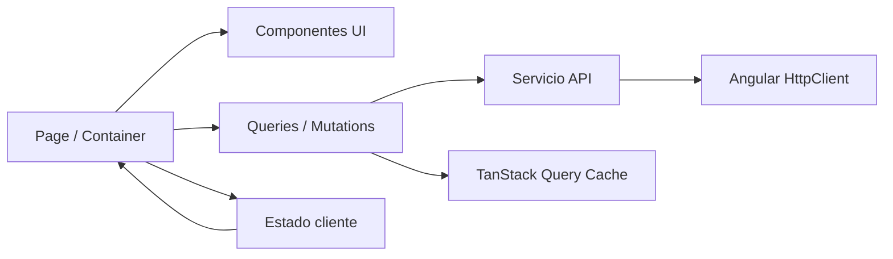

# Arquitectura frontend moderna para Angular

## Estado del documento

| Campo | Valor |
|---|---|
| Estado | Investigación consolidada |
| Fecha de revisión | 2026-08-08 |
| Alcance principal | Arquitectura, asincronía, HTTP, estado, caché, errores y testing |
| Restricción considerada | Proyecto sin monorepo y posible obligación de usar Angular 16 |
| Audiencia | Desarrollo frontend, arquitectura y liderazgo técnico |

Este documento consolida las conclusiones finales de la investigación sobre cómo estructurar una
aplicación Angular, qué herramientas usar para cada tipo de estado y cómo manejar peticiones HTTP,
caché, refetch, errores, timeout, reintentos y pruebas. El documento no reproduce recomendaciones
que quedaron descartadas durante la investigación.

La decisión principal es separar el **estado del servidor** del **estado cliente**:

- **Angular `HttpClient`** transporta las peticiones.
- **TanStack Query para Angular** administra consultas, caché, refetch, reintentos, mutaciones y
  estados asíncronos.
- **NgRx SignalStore** administra estado cliente en Angular moderno.
- **NgRx ComponentStore 16** administra estado de pantalla o feature cuando Angular 16 es una
  restricción.
- **NgRx Store** queda reservado para estado global complejo o flujos dirigidos por eventos.
- **Angular Router** es la fuente de verdad para estado que debe poder compartirse mediante URL.
- **Angular Reactive Forms** es la fuente de verdad durante la edición de formularios.

Esta arquitectura funciona en un único repositorio creado con Angular CLI. No requiere Nx ni un
monorepo.

---

## 1. Resumen ejecutivo

### 1.1 Recomendación para un proyecto Angular actual

Si el equipo puede elegir una versión de Angular que todavía reciba soporte:

```text
Angular soportado actualmente
+ Angular CLI
+ standalone components
+ feature-first architecture
+ Angular HttpClient
+ TanStack Query Angular
+ NgRx SignalStore
+ Angular Reactive Forms
+ Vitest
+ Angular Testing Library
+ Playwright
```

La combinación funcional es:

| Responsabilidad | Herramienta |
|---|---|
| Transporte HTTP | Angular `HttpClient` |
| Estado remoto, caché y sincronización | TanStack Query |
| Estado cliente local, de feature o global | NgRx SignalStore |
| Flujos globales dirigidos por eventos | NgRx Store y Effects, solo cuando se justifiquen |
| Formularios | Reactive Forms |
| Estado navegable o compartible | Angular Router |
| Unit e integration tests | Vitest y Angular Testing Library |
| End-to-end | Playwright |

### 1.2 Recomendación si Angular 16 es obligatorio

Si Angular 16 viene impuesto por una aplicación existente o una restricción de la empresa:

```text
Angular 16
+ Angular CLI
+ standalone components
+ feature-first architecture
+ Angular HttpClient
+ TanStack Query Angular, fijando una versión exacta
+ NgRx ComponentStore 16 para estado de pantalla o feature
+ NgRx Store 16 solo para estado global complejo
+ Angular Reactive Forms
+ Jasmine/Karma o Jest compatible con Angular 16
+ Angular Testing Library 13 o 14
+ Playwright
```

NgRx SignalStore no pertenece a esta variante porque apareció con NgRx 17 y requiere Angular 17
como mínimo.

### 1.3 Regla que evita la mayor parte de la complejidad

> TanStack Query es la fuente de verdad para los datos que vienen del backend. ComponentStore,
> SignalStore o NgRx Store son la fuente de verdad para el estado creado y controlado por el
> frontend. El mismo dato no debe mantenerse en ambos lugares.

Ejemplo:

- La lista de productos recibida de `GET /products` pertenece a TanStack Query.
- El modo `grid` o `list` elegido por el usuario pertenece al estado cliente.
- El término de búsqueda que debe sobrevivir una recarga y compartirse por enlace pertenece al
  Router.
- Los valores todavía no enviados de un formulario pertenecen al `FormGroup`.

---

## 2. Contexto de versiones y riesgos

### 2.1 Situación actual de Angular 16

Angular 16 ya no recibe soporte oficial. La política actual de Angular indica que las versiones 2
a 19 están fuera de soporte. La documentación consultada muestra Angular 22 como versión activa y
Angular 20 y 21 dentro de sus ventanas de soporte.

Fuente: [Angular versioning and releases](https://angular.dev/reference/releases).

Esto no impide mantener una aplicación Angular 16, pero sí cambia el riesgo:

- No se reciben las correcciones normales del framework.
- Las herramientas actuales pueden dejar de probar compatibilidad con Angular 16.
- Las guías modernas pueden mostrar APIs inexistentes en Angular 16.
- Las versiones de Node.js y TypeScript compatibles con Angular 16 también son antiguas.
- Las nuevas integraciones de testing pueden requerir Angular 19 o superior.

La tabla oficial de compatibilidad indica que Angular 16.1 y 16.2 trabajan con:

- Node.js `^16.14.0` o `^18.10.0`.
- TypeScript `>=4.9.3 <5.2.0`.
- RxJS `^6.5.3` o `^7.4.0`.

Fuente: [Angular version compatibility](https://angular.dev/reference/versions).

Node.js 16 y 18 están fuera de soporte. El equipo debe considerar este riesgo en CI, imágenes de
contenedor, herramientas locales y políticas de seguridad.

Fuente: [Node.js releases](https://nodejs.org/en/about/previous-releases).

### 2.2 Qué significa “Angular moderno” en este documento

“Angular moderno” no significa copiar cualquier ejemplo de la documentación actual. Significa:

- Usar una versión que todavía recibe soporte.
- Preferir standalone components.
- Organizar el código por dominio o feature.
- Usar Signals como primitiva de estado cliente.
- Mantener RxJS donde aporta coordinación asíncrona.
- Diferenciar estado del servidor y estado cliente.
- Elegir herramientas según la responsabilidad que resuelven.

### 2.3 Signals en Angular 16

Signals llegaron a Angular 16 como Developer Preview. La API existe, pero en esa versión no tenía
las mismas garantías de estabilidad que en versiones posteriores.

Si el proyecto Angular 16 ya acepta TanStack Query Angular, también está aceptando una solución que
utiliza Signals y que continúa marcada como experimental. Si la política técnica solo permite APIs
estables, la alternativa conservadora es `HttpClient + ComponentStore 16`.

Fuentes históricas correspondientes exactamente a Angular 16:

- [Angular 16 Signals guide](https://github.com/angular/angular/blob/16.2.x/aio/content/guide/signals.md).
- [Angular 16 standalone components guide](https://github.com/angular/angular/blob/16.2.x/aio/content/guide/standalone-components.md).

---

## 3. Objetivos arquitectónicos

La arquitectura propuesta busca que el equipo pueda:

1. Encontrar el código de una capacidad sin recorrer carpetas globales por tipo técnico.
2. Cambiar una feature sin modificar features no relacionadas.
3. Cargar features de forma diferida.
4. Mantener una sola fuente de verdad para cada dato.
5. Mostrar estados de carga, error y actualización sin combinar booleanos contradictorios.
6. Cancelar trabajo asíncrono que deja de ser relevante.
7. Probar reglas, transporte, estado y experiencia del usuario en niveles separados.
8. Empezar con un repositorio Angular CLI y adoptar tooling adicional únicamente si aparece una
   necesidad comprobable.

### 3.1 Decisión de repositorio

Se adopta un **modular monolith frontend** en un repositorio único.

Esto significa:

- Una aplicación Angular.
- Un solo `package.json`.
- Un único pipeline principal.
- Features aisladas mediante estructura y reglas de dependencias.
- Lazy loading por rutas.
- Sin Nx como requisito.
- Sin publicar librerías internas para cada feature.

Un monorepo podría evaluarse en el futuro si aparecen varias aplicaciones, varias librerías
publicables, equipos independientes o una necesidad real de ejecución incremental a gran escala.
No se introduce anticipadamente.

---

## 4. Arquitectura por dominio y feature

### 4.1 Estructura recomendada

```text
src/app/
├── core/
│   ├── auth/
│   ├── config/
│   ├── http/
│   ├── layout/
│   └── observability/
│
├── shared/
│   ├── ui/
│   ├── directives/
│   ├── pipes/
│   └── utilities/
│
└── features/
    ├── products/
    │   ├── data-access/
    │   │   ├── products.api.ts
    │   │   ├── products.keys.ts
    │   │   ├── products.models.ts
    │   │   ├── products.queries.ts
    │   │   └── products.mapper.ts
    │   │
    │   ├── state/
    │   │   └── products-page.store.ts
    │   │
    │   ├── pages/
    │   │   ├── products-page.component.ts
    │   │   └── product-detail-page.component.ts
    │   │
    │   ├── ui/
    │   │   ├── product-card.component.ts
    │   │   ├── products-list.component.ts
    │   │   ├── products-skeleton.component.ts
    │   │   └── products-error.component.ts
    │   │
    │   ├── util/
    │   └── products.routes.ts
    │
    └── checkout/
        ├── data-access/
        ├── state/
        ├── pages/
        ├── ui/
        ├── util/
        └── checkout.routes.ts
```

Esta estructura sigue la recomendación feature-first del estilo moderno de Angular y un enfoque
DDD ligero:

- **Feature:** capacidad visible o caso de uso.
- **Data access:** comunicación y modelos de integración.
- **State:** estado cliente exclusivo de la feature.
- **Pages:** componentes de ruta que coordinan.
- **UI:** componentes presentacionales.
- **Util:** lógica pura exclusiva del dominio.

Fuentes:

- [Angular Style Guide](https://angular.dev/style-guide).
- [Modern Architectures with Angular, Part 1](https://www.angulararchitects.io/en/blog/modern-architectures-with-angular-part-1-strategic-design-with-sheriff-and-standalone-components/).

### 4.2 Responsabilidades

| Área | Responsabilidad | No debe contener |
|---|---|---|
| `core` | Infraestructura singleton de aplicación | Lógica exclusiva de una feature |
| `shared/ui` | Componentes reutilizables sin conocimiento del negocio | Acceso HTTP o estado global |
| `feature/data-access` | API, DTO, mappers, query keys y consultas | Decisiones visuales |
| `feature/state` | Estado cliente de la feature | Copias de la caché remota |
| `feature/pages` | Coordinación de la pantalla | Detalles de transporte |
| `feature/ui` | Presentación y eventos de usuario | Peticiones directas |
| `feature/util` | Funciones puras y reglas locales | Dependencias de Angular innecesarias |

### 4.3 Dependencias permitidas



Reglas:

- Un componente UI no llama a `HttpClient`.
- Una página no construye URLs.
- El servicio API no muestra mensajes ni abre toasts.
- El store cliente no duplica colecciones administradas por TanStack Query.
- Una feature no importa internals de otra feature.
- La comunicación entre features ocurre mediante contratos públicos, Router o estado global
  intencional.

### 4.4 Standalone y lazy loading

Angular 16 ya permite utilizar standalone components de forma estable.

Las rutas de cada feature deben cargarse de forma diferida:

```ts
export const appRoutes: Routes = [
  {
    path: 'products',
    loadChildren: () =>
      import('./features/products/products.routes')
        .then(module => module.PRODUCTS_ROUTES),
  },
];
```

Y la feature:

```ts
export const PRODUCTS_ROUTES: Routes = [
  {
    path: '',
    providers: [ProductsPageStore],
    loadComponent: () =>
      import('./pages/products-page.component')
        .then(module => module.ProductsPageComponent),
  },
  {
    path: ':productId',
    loadComponent: () =>
      import('./pages/product-detail-page.component')
        .then(module => module.ProductDetailPageComponent),
  },
];
```

Los providers de ruta permiten que un store o servicio exista solamente durante la vida de esa
feature.

---

## 5. Taxonomía de estado

Antes de elegir una librería, el equipo debe clasificar el dato.

### 5.1 Estado del servidor

El backend es el propietario del dato. El frontend mantiene una copia potencialmente
desactualizada.

Ejemplos:

- Productos.
- Categorías.
- Inventario.
- Usuarios obtenidos de una API.
- Órdenes.
- Notificaciones del servidor.
- Perfil y permisos obtenidos del backend.
- Resultados de búsqueda.
- Historial de transacciones.

Herramienta recomendada: **TanStack Query**.

### 5.2 Estado cliente local

El componente es el propietario y el estado desaparece al destruirlo.

Ejemplos:

- Tooltip abierto.
- Tab seleccionada.
- Acordeón expandido.
- Menú contextual visible.
- Estado hover o focus.

Herramienta recomendada:

- Campo local.
- Signal en Angular soportado.
- Input/output cuando el propietario es el componente padre.

### 5.3 Estado cliente de feature

La pantalla o feature es la propietaria. Varias partes de la misma experiencia lo consumen.

Ejemplos:

- Paso actual de un wizard.
- Selección temporal de productos.
- Modo grid o list.
- Filtros todavía no aplicados.
- Borrador de un flujo multipantalla.
- Estado de una edición compleja.

Herramienta recomendada:

- NgRx SignalStore en Angular moderno.
- NgRx ComponentStore 16 en Angular 16.

### 5.4 Estado global cliente

Varias features distantes lo necesitan y debe sobrevivir navegación.

Ejemplos:

- Organización o tienda activa.
- Contexto global de permisos ya interpretado por el frontend.
- Checkout que cruza varias rutas.
- Preferencias globales no representadas en la URL.
- Estado de una aplicación tipo editor con muchas herramientas.

Herramienta recomendada:

- NgRx SignalStore global en Angular moderno.
- NgRx Store 16 si Angular 16 es obligatorio y el estado es realmente global.

### 5.5 Estado del Router

Si el usuario debe poder:

- Compartir un enlace.
- Usar back/forward.
- Recargar sin perder el filtro.
- Guardar la vista en favoritos.

Entonces el Router debe ser la fuente de verdad.

Ejemplos:

- `/products?page=2&search=phone`.
- `/orders/123`.
- `/reports?from=2026-01-01&to=2026-01-31`.

### 5.6 Estado de formularios

Durante la edición, `FormControl`, `FormGroup` y `FormArray` son la fuente de verdad.

No es necesario copiar cada pulsación al store. El store puede conservar un borrador al cambiar
de paso, pero no debe duplicar permanentemente el árbol completo del formulario sin una razón.

### 5.7 Matriz de decisión

| Pregunta | Sí | No |
|---|---|---|
| ¿El backend es el propietario? | TanStack Query | Continuar |
| ¿Debe aparecer en la URL? | Router | Continuar |
| ¿Es un valor todavía en edición? | Reactive Forms | Continuar |
| ¿Solo lo usa un componente? | Estado local | Continuar |
| ¿Lo usa una sola feature? | SignalStore o ComponentStore | Continuar |
| ¿Lo usan múltiples features y sobrevive navegación? | Store global | Evitar globalizar |

---

## 6. Stack recomendado por responsabilidad

### 6.1 Tabla final

| Necesidad | Angular actual | Angular 16 |
|---|---|---|
| HTTP | `HttpClient` | `HttpClient` |
| Server state | TanStack Query | TanStack Query con versión exacta |
| Estado local | Signals | Campos, Signals con cautela o ComponentStore |
| Estado de feature | NgRx SignalStore | NgRx ComponentStore 16 |
| Estado global | NgRx SignalStore | NgRx Store 16 |
| Flujos event-driven | NgRx Store/Effects | NgRx Store 16/Effects |
| Formularios | Reactive Forms | Reactive Forms |
| Estado compartible | Router | Router |
| Unit tests | Vitest | Jasmine/Karma o Jest compatible |
| Component tests | Angular Testing Library | Angular Testing Library 13/14 |
| E2E | Playwright | Playwright |

### 6.2 Comparación aproximada con React

| Ecosistema React | Ecosistema Angular |
|---|---|
| TanStack Query | TanStack Query Angular |
| Zustand | NgRx SignalStore |
| Redux Toolkit | NgRx Store |
| fetch o Axios | Angular `HttpClient` |
| React Hook Form | Angular Reactive Forms, sin equivalencia exacta |

Zustand permite usar `zustand/vanilla`, pero su integración principal está diseñada alrededor de
hooks y del ciclo de renderizado de React. Usarlo en Angular obligaría a crear la integración con
inyección de dependencias, ciclo de vida, Signals y change detection.

Fuente: [Zustand repository](https://github.com/pmndrs/zustand).

### 6.3 Herramientas que no forman parte del stack

- **Zustand:** no es una integración Angular nativa.
- **NgRx Data:** está en maintenance mode y el equipo de NgRx no lo recomienda para proyectos
  nuevos.
- **`@ngneat/query` y Elf:** los repositorios originales de ngneat fueron eliminados en junio de
  2026. El archivo comunitario advierte que no ofrece mantenimiento, soporte ni actualizaciones de
  seguridad.
- **Apollo Angular:** se considera cuando el backend es GraphQL; no es la elección general para
  REST.
- **NGXS:** puede conservarse si una organización ya lo utiliza, pero no desplaza la recomendación
  principal de esta investigación.

Fuentes:

- [NgRx 17 announcement](https://dev.to/ngrx/announcing-ngrx-v17-introducing-ngrx-signals-operators-performance-improvements-workshops-and-more-55e4).
- [ngneat community archive](https://github.com/ngneat-archive).

---

## 7. TanStack Query como capa de estado remoto

### 7.1 Qué resuelve

TanStack Query administra:

- Caché.
- Deduplicación de peticiones.
- Estado de primera carga.
- Refetch en segundo plano.
- Errores.
- Reintentos.
- Backoff.
- Datos anteriores durante una actualización.
- `staleTime`.
- Invalidación.
- Paginación.
- Infinite queries.
- Mutaciones.
- Actualizaciones optimistas.
- Cancelación.
- Refetch al reconectar.
- Refetch al volver a enfocar la aplicación.
- Garbage collection de consultas inactivas.
- Structural sharing de resultados JSON.

Fuente: [TanStack Query Angular overview](https://tanstack.com/query/latest/docs/framework/angular/overview).

### 7.2 Estado experimental

El adaptador oficial se instala como:

```bash
npm install @tanstack/angular-query-experimental
```

La documentación declara compatibilidad con Angular 16 o superior, pero también advierte que
puede introducir breaking changes en versiones minor y patch.

Fuente: [TanStack Query Angular installation](https://tanstack.com/query/latest/docs/framework/angular/installation).

En producción, la dependencia debe fijarse a una versión exacta:

```json
{
  "dependencies": {
    "@tanstack/angular-query-experimental": "VERSION_PROBADA"
  }
}
```

No se debe utilizar `^` o `~` mientras la API continúe experimental:

```json
{
  "dependencies": {
    "@tanstack/angular-query-experimental": "^VERSION_PROBADA"
  }
}
```

La versión exacta se selecciona y valida en el proyecto; este documento no fija un número que
pueda quedar obsoleto.

Decisión según el nivel de riesgo:

| Contexto | Decisión |
|---|---|
| Producto normal con CI, tests y upgrades controlados | TanStack Query fijado a patch exacto |
| Equipo dispuesto a absorber cambios del adapter | TanStack Query fijado y actualizado conscientemente |
| Entorno regulado que prohíbe dependencias experimentales | `HttpClient + ComponentStore 16` y máquina de estados explícita |
| Aplicación nueva sin obligación de Angular 16 | Primero adoptar una versión soportada de Angular |

### 7.3 TanStack Query no sustituye HttpClient

`HttpClient` conserva la responsabilidad de:

- Construir y enviar HTTP.
- Aplicar headers y parámetros.
- Interactuar con interceptors.
- Producir el `Observable`.
- Convertir la respuesta inicial.

TanStack Query conserva la responsabilidad de:

- Identificar la consulta.
- Ejecutarla.
- Mantener caché.
- Exponer estados.
- Invalidar y refetchear.
- Coordinar reintentos y cancelación.

### 7.4 Configuración de aplicación

Ejemplo para una aplicación standalone:

```ts
import { ApplicationConfig } from '@angular/core';
import {
  provideHttpClient,
  withInterceptors,
} from '@angular/common/http';
import {
  provideTanStackQuery,
  QueryClient,
} from '@tanstack/angular-query-experimental';

export const appConfig: ApplicationConfig = {
  providers: [
    provideHttpClient(
      withInterceptors([
        authInterceptor,
        correlationIdInterceptor,
      ]),
    ),

    provideTanStackQuery(
      new QueryClient({
        defaultOptions: {
          queries: {
            staleTime: 60_000,
            retry: shouldRetryQuery,
            retryDelay: retryDelay,
            refetchOnWindowFocus: true,
            refetchOnReconnect: true,
          },
          mutations: {
            retry: false,
          },
        },
      }),
    ),
  ],
};
```

### 7.5 Defaults que el equipo debe conocer

Por defecto, TanStack Query:

- Considera las consultas cacheadas como stale inmediatamente.
- Refetchea consultas stale al montar un consumidor.
- Refetchea consultas stale cuando la ventana recupera foco.
- Refetchea consultas stale al recuperar la conexión.
- Mantiene consultas inactivas en caché durante cinco minutos.
- Reintenta tres veces las consultas fallidas con backoff.
- Aplica structural sharing a valores JSON.

Fuente: [Important defaults](https://tanstack.com/query/latest/docs/framework/angular/guides/important-defaults).

No se deben aceptar esos defaults sin discutirlos. Cada dominio debe definir:

- Cuánto tiempo un resultado puede considerarse fresh.
- Qué errores son transitorios.
- Si volver al tab debe causar tráfico.
- Si la operación tolera polling.
- Cuánto tiempo conviene conservar datos inactivos.

### 7.6 Query keys

La query key identifica el dato y todas las variables que cambian su resultado.

```ts
export const productsKeys = {
  all: ['products'] as const,

  lists: () =>
    [...productsKeys.all, 'list'] as const,

  list: (filters: ProductFilters) =>
    [...productsKeys.lists(), filters] as const,

  details: () =>
    [...productsKeys.all, 'detail'] as const,

  detail: (productId: string) =>
    [...productsKeys.details(), productId] as const,
};
```

Reglas:

- La key incluye filtros, ordenamiento, página y demás variables relevantes.
- Las keys se centralizan por dominio.
- Una misma consulta usa siempre la misma estructura.
- La invalidación apunta al nivel correcto: todo el dominio, listas o detalle.
- La key no incluye valores no serializables.

### 7.7 Servicio API

El servicio API recibe parámetros del dominio, usa `HttpClient`, aplica timeout, convierte DTO y
normaliza errores.

```ts
import {
  HttpClient,
  HttpErrorResponse,
} from '@angular/common/http';
import { Injectable, inject } from '@angular/core';
import {
  Observable,
  TimeoutError,
  catchError,
  map,
  throwError,
  timeout,
} from 'rxjs';

@Injectable({ providedIn: 'root' })
export class ProductsApi {
  private readonly http = inject(HttpClient);

  getProducts(
    filters: ProductFilters,
  ): Observable<Product[]> {
    return this.http
      .get<ProductDto[]>('/api/products', {
        params: {
          search: filters.search,
          page: filters.page,
        },
      })
      .pipe(
        timeout(10_000),
        map(dtos => dtos.map(mapProductDto)),
        catchError(error =>
          throwError(() => normalizeHttpError(error)),
        ),
      );
  }

  updateProduct(
    command: UpdateProductCommand,
  ): Observable<Product> {
    return this.http
      .put<ProductDto>(
        '/api/products/' + command.productId,
        command.changes,
      )
      .pipe(
        timeout(15_000),
        map(mapProductDto),
        catchError(error =>
          throwError(() => normalizeHttpError(error)),
        ),
      );
  }
}
```

El tipo genérico de `HttpClient` es una aserción de TypeScript; no valida el JSON en runtime. Para
límites de alta criticidad, el equipo debe validar la respuesta antes de mapearla al dominio.

### 7.8 Consulta con cancelación

```ts
import { Component, inject, signal } from '@angular/core';
import { injectQuery } from
  '@tanstack/angular-query-experimental';
import {
  fromEvent,
  lastValueFrom,
  takeUntil,
} from 'rxjs';

@Component({
  selector: 'app-products-page',
  standalone: true,
  templateUrl: './products-page.component.html',
})
export class ProductsPageComponent {
  private readonly api = inject(ProductsApi);

  readonly filters = signal<ProductFilters>({
    search: '',
    page: 1,
  });

  readonly productsQuery = injectQuery(() => {
    const filters = this.filters();

    return {
      queryKey: productsKeys.list(filters),

      queryFn: ({ signal: abortSignal }) =>
        lastValueFrom(
          this.api
            .getProducts(filters)
            .pipe(
              takeUntil(
                fromEvent(abortSignal, 'abort'),
              ),
            ),
        ),

      staleTime: 60_000,
    };
  });

  retry(): void {
    this.productsQuery.refetch();
  }
}
```

TanStack Query entrega un `AbortSignal`. Cuando la consulta deja de ser relevante, el adapter puede
cancelar el Observable mediante `takeUntil`.

Fuente: [TanStack Query cancellation](https://tanstack.com/query/latest/docs/framework/angular/guides/query-cancellation).

### 7.9 Estado de una query

TanStack Query separa dos conceptos:

- `status` responde: “¿existen datos?”.
- `fetchStatus` responde: “¿la función de consulta está ejecutándose?”.

Estados principales:

| Propiedad | Significado |
|---|---|
| `isPending()` | La consulta todavía no tiene datos |
| `isSuccess()` | Hay datos disponibles |
| `isError()` | La última ejecución terminó con error |
| `isFetching()` | Existe una ejecución en curso, incluso en background |
| `data()` | Último resultado disponible |
| `error()` | Error normalizado |
| `refetch()` | Solicita una nueva ejecución |
| `failureCount()` | Cantidad de fallos observados |

Fuente: [TanStack Query basics](https://tanstack.com/query/latest/docs/framework/angular/guides/queries).

### 7.10 Mutaciones e invalidación

Una operación que cambia datos del servidor se modela como mutation:

```ts
import {
  injectMutation,
  QueryClient,
} from '@tanstack/angular-query-experimental';
import { inject } from '@angular/core';
import { lastValueFrom } from 'rxjs';

export class ProductEditorComponent {
  private readonly api = inject(ProductsApi);
  private readonly queryClient = inject(QueryClient);

  readonly updateProductMutation =
    injectMutation(() => ({
      mutationFn: (
        command: UpdateProductCommand,
      ) => lastValueFrom(
        this.api.updateProduct(command),
      ),

      retry: false,

      onSuccess: async product => {
        await Promise.all([
          this.queryClient.invalidateQueries({
            queryKey: productsKeys.lists(),
          }),
          this.queryClient.invalidateQueries({
            queryKey:
              productsKeys.detail(product.id),
          }),
        ]);
      },
    }));

  save(command: UpdateProductCommand): void {
    this.updateProductMutation.mutate(command);
  }
}
```

La mutation expone su propio estado:

- `isPending()`.
- `isError()`.
- `isSuccess()`.
- `error()`.
- `data()`.

Cuando termina correctamente, invalida las queries relacionadas. No se llama manualmente a
`ngOnInit()` y no se mantiene un `Subject<void>` solo para recargar.

Fuente: [Invalidations from mutations](https://tanstack.com/query/latest/docs/framework/angular/guides/invalidations-from-mutations).

### 7.11 TanStack Query y el estado global

TanStack Query no reemplaza el estado cliente. Reemplaza el wiring utilizado para almacenar
respuestas HTTP dentro de un store cliente.

Ejemplo:

```text
Antes:
globalState = {
  products,
  orders,
  users,
  theme,
  sidebarOpen
}

Después:
TanStack Query = {
  products,
  orders,
  users
}

clientState = {
  theme,
  sidebarOpen
}
```

Fuente: [Does TanStack Query replace state managers?](https://tanstack.com/query/latest/docs/framework/angular/guides/does-this-replace-client-state).

---

## 8. Manejo limpio del estado de pantalla

### 8.1 No usar booleanos independientes para el mismo proceso

Este diseño permite combinaciones imposibles:

```ts
isLoading = false;
isRefreshing = false;
hasError = false;
isRetrying = false;
products: Product[] = [];
errorMessage = '';
```

Por ejemplo, una pantalla podría terminar con `isLoading = true` y `hasError = true` sin que quede
claro qué debe renderizar.

Con TanStack Query, la query ya actúa como máquina de estados. Si no se utiliza TanStack Query, el
estado debe modelarse como una unión discriminada.

### 8.2 Máquina de estados alternativa

```ts
export type ScreenState<T> =
  | {
      status: 'loading';
      data: null;
      error: null;
    }
  | {
      status: 'refreshing';
      data: T;
      error: null;
    }
  | {
      status: 'success';
      data: T;
      error: null;
      updatedAt: number;
    }
  | {
      status: 'error';
      data: T | null;
      error: AppError;
    };
```

Esta unión evita estados contradictorios y diferencia:

- Primera carga.
- Actualización con datos anteriores.
- Éxito.
- Error sin datos.
- Error de actualización conservando datos stale.

### 8.3 Contrato visual de la pantalla

| Situación | Comportamiento |
|---|---|
| Primera carga | Mostrar skeleton |
| Éxito con resultados | Mostrar contenido |
| Éxito sin resultados | Mostrar empty state |
| Refetch | Mantener contenido y mostrar indicador discreto |
| Error inicial | Mostrar error de página completa |
| Error durante refetch | Conservar contenido y mostrar warning inline |
| Mutation pendiente | Deshabilitar el control que la inició |
| Error de validación | Mostrar el error junto al campo |
| Error transitorio agotado | Mostrar retry manual |

### 8.4 Template compatible con Angular 16

Angular 16 no tiene la sintaxis `@if`. El ejemplo utiliza `*ngIf`:

```html
<!-- Primera carga: todavía no existen datos -->
<app-products-skeleton
  *ngIf="productsQuery.isPending()">
</app-products-skeleton>

<!-- Error inicial: no existen datos que conservar -->
<app-full-page-error
  *ngIf="
    productsQuery.isError() &&
    !productsQuery.data()
  "
  [message]="productsQuery.error()?.message"
  (retry)="retry()">
</app-full-page-error>

<!-- Existe contenido -->
<section *ngIf="productsQuery.data() as products">
  <app-inline-loading
    *ngIf="productsQuery.isFetching()">
    Actualizando productos…
  </app-inline-loading>

  <app-inline-warning
    *ngIf="productsQuery.isError()">
    No se pudo actualizar la información.
    Estás viendo los datos anteriores.

    <button type="button" (click)="retry()">
      Reintentar
    </button>
  </app-inline-warning>

  <app-empty-state
    *ngIf="products.length === 0">
  </app-empty-state>

  <app-products-list
    *ngIf="products.length > 0"
    [products]="products">
  </app-products-list>
</section>
```

### 8.5 Operaciones independientes

Una pantalla puede cargar una lista mientras crea, elimina o actualiza elementos. No debe existir
un único `isLoading` para todas las operaciones.

Ejemplo:

```ts
interface ProductsUiState {
  deletingProductIds: ReadonlySet<string>;
  editingProductId: string | null;
}
```

El estado remoto de cada mutation permanece en su mutation. El estado cliente solo representa la
interacción visual que no pertenece al servidor.

---

## 9. Errores, timeout y reintentos

### 9.1 Error normalizado

Los componentes no deben interpretar directamente `HttpErrorResponse` ni mostrar mensajes crudos
del backend.

```ts
export type AppErrorKind =
  | 'timeout'
  | 'network'
  | 'unauthorized'
  | 'forbidden'
  | 'not-found'
  | 'validation'
  | 'conflict'
  | 'rate-limit'
  | 'server'
  | 'unknown';

export interface AppError {
  kind: AppErrorKind;
  title: string;
  message: string;
  retryable: boolean;
  status?: number;
  fieldErrors?: Readonly<
    Record<string, readonly string[]>
  >;
}
```

### 9.2 Clasificación

```ts
import {
  HttpErrorResponse,
} from '@angular/common/http';
import { TimeoutError } from 'rxjs';

export function normalizeHttpError(
  error: unknown,
): AppError {
  if (error instanceof TimeoutError) {
    return {
      kind: 'timeout',
      title: 'La solicitud tardó demasiado',
      message:
        'No recibimos una respuesta a tiempo.',
      retryable: true,
    };
  }

  if (!(error instanceof HttpErrorResponse)) {
    return {
      kind: 'unknown',
      title: 'Error inesperado',
      message:
        'No fue posible completar la operación.',
      retryable: false,
    };
  }

  switch (error.status) {
    case 0:
      return {
        kind: 'network',
        title: 'Sin conexión',
        message:
          'No fue posible conectarse al servidor.',
        retryable: true,
        status: 0,
      };

    case 400:
    case 422:
      return {
        kind: 'validation',
        title: 'Datos inválidos',
        message:
          'Revisa la información enviada.',
        retryable: false,
        status: error.status,
        fieldErrors:
          readFieldErrors(error.error),
      };

    case 401:
      return {
        kind: 'unauthorized',
        title: 'Sesión expirada',
        message:
          'Vuelve a iniciar sesión.',
        retryable: false,
        status: 401,
      };

    case 403:
      return {
        kind: 'forbidden',
        title: 'Acción no permitida',
        message:
          'No tienes permiso para continuar.',
        retryable: false,
        status: 403,
      };

    case 404:
      return {
        kind: 'not-found',
        title: 'Recurso no encontrado',
        message:
          'El recurso solicitado no existe.',
        retryable: false,
        status: 404,
      };

    case 409:
      return {
        kind: 'conflict',
        title: 'Conflicto de actualización',
        message:
          'La información cambió en otro proceso.',
        retryable: false,
        status: 409,
      };

    case 429:
      return {
        kind: 'rate-limit',
        title: 'Demasiadas solicitudes',
        message:
          'Espera un momento antes de reintentar.',
        retryable: true,
        status: 429,
      };

    case 408:
    case 500:
    case 502:
    case 503:
    case 504:
      return {
        kind: 'server',
        title: 'Servicio no disponible',
        message:
          'Inténtalo nuevamente en unos segundos.',
        retryable: true,
        status: error.status,
      };

    default:
      return {
        kind: 'unknown',
        title: 'No fue posible continuar',
        message:
          'Ocurrió un error inesperado.',
        retryable: false,
        status: error.status,
      };
  }
}
```

El frontend puede registrar el detalle técnico mediante observabilidad, pero muestra un mensaje
controlado y accionable al usuario.

### 9.3 Timeout

TanStack Query no define por sí mismo el timeout de `HttpClient`. El servicio API establece el
límite con RxJS:

```ts
return this.http
  .get<ProductDto[]>('/api/products')
  .pipe(
    timeout(10_000),
    catchError(error =>
      throwError(() => normalizeHttpError(error)),
    ),
  );
```

Punto de partida:

- GET normales: 8 a 15 segundos.
- Operaciones pesadas: límite explícito por endpoint.
- Exportaciones largas: usar jobs asíncronos en backend en vez de aumentar el timeout
  indefinidamente.

El valor final depende del contrato de la API y de métricas reales.

### 9.4 Política de retry

```ts
export function shouldRetryQuery(
  failureCount: number,
  error: unknown,
): boolean {
  const appError = error as AppError;

  return (
    appError.retryable &&
    failureCount < 2
  );
}

export function retryDelay(
  attempt: number,
): number {
  return Math.min(
    500 * 2 ** attempt,
    4_000,
  );
}
```

Matriz:

| Situación | Retry automático |
|---|---:|
| Timeout | Sí, uno o dos |
| Error de red | Sí, uno o dos |
| HTTP 408 | Sí |
| HTTP 429 | Sí, respetando `Retry-After` cuando exista |
| HTTP 500, 502, 503, 504 | Sí |
| HTTP 400 | No |
| HTTP 401 | No |
| HTTP 403 | No |
| HTTP 404 | No |
| HTTP 409 | Normalmente no |
| HTTP 422 | No |
| Validación | No |
| POST no idempotente | No automáticamente |
| Pago o creación de orden | No sin idempotency key |

Después de agotar el retry automático, la pantalla ofrece retry manual.

### 9.5 HTTP 401 y refresh de sesión

El 401 es una responsabilidad transversal de autenticación, no un error normal de pantalla.

Flujo:

1. La API devuelve 401.
2. El interceptor intenta renovar la sesión una sola vez.
3. Las peticiones concurrentes esperan el mismo proceso de renovación.
4. Si la renovación funciona, las peticiones seguras se reanudan.
5. Si falla, el sistema cierra la sesión y redirige al login.

No se deben iniciar múltiples refresh simultáneos ni reintentar 401 desde cada componente.

### 9.6 Errores de validación

Los errores 400 o 422 con campos identificables se asignan al formulario:

```ts
form.controls.name.setErrors({
  server: 'El nombre ya está en uso.',
});
```

El resumen general puede mostrar que existen errores, pero la corrección debe aparecer junto al
campo responsable.

---

## 10. Refetch, caché e invalidación

### 10.1 No recargar llamando a ngOnInit

`ngOnInit` describe inicialización del componente. No es una API de recarga.

Con TanStack Query:

- Retry manual: `query.refetch()`.
- Cambio de filtros: cambia la query key.
- Mutation exitosa: `queryClient.invalidateQueries()`.
- Regreso a la ventana: política `refetchOnWindowFocus`.
- Recuperación de red: política `refetchOnReconnect`.

### 10.2 Stale time por tipo de dato

Ejemplos iniciales, sujetos a métricas:

| Dato | `staleTime` inicial |
|---|---:|
| Inventario muy cambiante | 5 a 15 segundos |
| Lista de productos | 30 a 120 segundos |
| Categorías | 5 a 30 minutos |
| Catálogos de referencia | 30 minutos a Infinity |
| Permisos cargados al iniciar sesión | Infinity con invalidación al cambiar sesión |

`Infinity` mantiene la posibilidad de invalidación manual. La opción `static` es más estricta y
evita incluso algunas invalidaciones; se reserva para datos que no pueden cambiar durante la
sesión.

### 10.3 Datos anteriores durante refetch

La pantalla no debe desaparecer cada vez que ocurre un refetch:

```text
success + idle
    ↓ refetch
success + fetching
    ↓ error
error + datos anteriores
```

La UI conserva el contenido y muestra:

- Indicador pequeño mientras actualiza.
- Warning inline si falla.
- Marca “última actualización” si el dominio lo necesita.

### 10.4 Polling

Polling se utiliza solo cuando el dominio requiere actualizaciones periódicas y no existe push:

```ts
refetchInterval: 30_000
```

El equipo debe definir:

- Frecuencia.
- Si continúa en background.
- Qué ocurre offline.
- Qué consultas se detienen cuando la ruta deja de estar activa.

### 10.5 Actualizaciones optimistas

Una actualización optimista es apropiada cuando:

- La operación es frecuente.
- La probabilidad de éxito es alta.
- El rollback es comprensible.
- El usuario obtiene un beneficio visible.

No es apropiada por defecto en:

- Pagos.
- Cancelaciones irreversibles.
- Cambios con validaciones complejas.
- Operaciones cuyo resultado del backend cambia significativamente el dato.

---

## 11. Estado cliente con NgRx

### 11.1 NgRx SignalStore en Angular moderno

NgRx SignalStore es la alternativa Angular más cercana al rol que cumple Zustand:

- Está basado en Signals.
- Produce un servicio inyectable.
- Puede proporcionarse en componente, ruta o root.
- Define estado mediante `withState`.
- Define derivados mediante `withComputed`.
- Define acciones mediante `withMethods`.
- Integra RxJS de forma opt-in.
- Protege el estado contra modificaciones externas por defecto.

Fuente: [NgRx SignalStore](https://ngrx.io/guide/signals/signal-store).

La fuente experta consultada describe el enfoque signals-first y SignalStore como mainstream para
estado cliente, mientras recomienda evaluar TanStack Query antes de construir caché remota dentro
del store.

Fuente: [Angular State Management for 2025, updated 2026](https://nx.dev/blog/angular-state-management-2025).

SignalStore apareció con NgRx 17. La versión 17 requiere Angular 17.

Fuente: [NgRx 17 announcement](https://dev.to/ngrx/announcing-ngrx-v17-introducing-ngrx-signals-operators-performance-improvements-workshops-and-more-55e4).

### 11.2 NgRx ComponentStore 16

ComponentStore es la elección compatible para estado local o de feature en Angular 16:

- `setState` inicializa.
- `select` deriva datos.
- `updater` modifica el estado.
- `effect` coordina efectos.
- El provider puede limitar su vida al componente o ruta.

Fuente: [NgRx ComponentStore 16](https://v16.ngrx.io/guide/component-store).

```ts
interface ProductsPageState {
  selectedProductId: string | null;
  view: 'grid' | 'list';
  filtersPanelOpen: boolean;
}

const initialState: ProductsPageState = {
  selectedProductId: null,
  view: 'grid',
  filtersPanelOpen: false,
};

@Injectable()
export class ProductsPageStore
  extends ComponentStore<ProductsPageState> {

  constructor() {
    super(initialState);
  }

  readonly selectedProductId$ =
    this.select(
      state => state.selectedProductId,
    );

  readonly view$ =
    this.select(state => state.view);

  readonly selectProduct =
    this.updater(
      (
        state,
        selectedProductId: string | null,
      ) => ({
        ...state,
        selectedProductId,
      }),
    );

  readonly setView =
    this.updater(
      (
        state,
        view: 'grid' | 'list',
      ) => ({
        ...state,
        view,
      }),
    );

  readonly toggleFiltersPanel =
    this.updater(state => ({
      ...state,
      filtersPanelOpen:
        !state.filtersPanelOpen,
    }));
}
```

Se proporciona en la ruta o pantalla:

```ts
{
  path: '',
  providers: [ProductsPageStore],
  loadComponent: () =>
    import('./pages/products-page.component')
      .then(module =>
        module.ProductsPageComponent
      ),
}
```

### 11.3 NgRx Store global

NgRx Store se utiliza cuando un store local o un servicio ya no son suficientes.

La guía SHARI ayuda a decidir:

- **Shared:** muchas partes consumen el estado.
- **Hydrated:** se persiste y rehidrata.
- **Available:** debe existir al regresar a una ruta.
- **Retrieved:** se obtiene mediante side effects.
- **Impacted:** múltiples acciones o fuentes lo modifican.

Fuente: [Why use NgRx Store 16](https://v16.ngrx.io/guide/store/why).

NgRx Store aporta:

- Acciones explícitas.
- Reducers puros.
- Selectores memoizados.
- Effects.
- Serialización.
- Redux DevTools.
- Auditoría de transiciones.

El coste es:

- Más conceptos.
- Más archivos.
- Mayor necesidad de RxJS y Redux.
- Riesgo de convertir cualquier dato en estado global.

No se usa solo porque una lista aparece en dos componentes. Si la lista viene del backend,
TanStack Query ya puede compartir y deduplicar la consulta.

### 11.4 Effects y TanStack Query

No se debe implementar el mismo flujo en ambos:

```text
Componente
  → action
  → effect
  → HttpClient
  → reducer
  → Store

y simultáneamente:

Componente
  → TanStack Query
  → HttpClient
  → Query cache
```

El equipo elige una fuente de verdad.

NgRx Effects se conserva para:

- Workflows globales event-driven.
- Integraciones que reaccionan a múltiples acciones.
- Procesos que no pertenecen a una query específica.
- Coordinación global que necesita trazabilidad mediante acciones.

---

## 12. Asincronía y RxJS

### 12.1 Papel de RxJS

Signals no eliminan RxJS. Cada herramienta resuelve un problema distinto:

- Signals representan valores reactivos actuales.
- RxJS coordina flujos asíncronos, eventos y concurrencia.
- TanStack Query administra el ciclo de vida del estado remoto.
- Promise sirve como frontera para algunas query functions.

### 12.2 Reglas

- No crear nested subscriptions.
- No suscribirse en componentes si `async` pipe, Signals o TanStack Query pueden consumir el flujo.
- No usar `Subject` como variable mutable general.
- Cancelar flujos ligados al ciclo de vida.
- Elegir el operador de aplanamiento según la semántica.
- Tratar los Observables de `HttpClient` como cold: cada suscripción puede emitir una nueva
  petición.

Fuente: [Angular HTTP: making requests](https://angular.dev/guide/http/making-requests).

### 12.3 Operadores de concurrencia

| Operador | Semántica | Uso típico |
|---|---|---|
| `switchMap` | Cancela la operación anterior y conserva la última | Búsqueda, filtros, navegación |
| `exhaustMap` | Ignora triggers mientras una operación está activa | Login, confirmar pago, doble click |
| `concatMap` | Ejecuta en orden | Cola de escrituras, eventos ordenados |
| `mergeMap` | Ejecuta en paralelo | Peticiones independientes |

#### Búsqueda

```ts
searchControl.valueChanges.pipe(
  debounceTime(300),
  distinctUntilChanged(),
  switchMap(query =>
    productsApi.search(query),
  ),
);
```

#### Evitar doble submit

```ts
submit$.pipe(
  exhaustMap(command =>
    checkoutApi.confirm(command),
  ),
);
```

#### Escrituras ordenadas

```ts
saveDraft$.pipe(
  concatMap(draft =>
    draftApi.save(draft),
  ),
);
```

#### Trabajo paralelo

```ts
ids$.pipe(
  mergeMap(id =>
    productsApi.getProduct(id),
    4,
  ),
);
```

### 12.4 `shareReplay`

Si una fuente RxJS se comparte sin TanStack Query:

```ts
readonly data$ = source$.pipe(
  shareReplay({
    bufferSize: 1,
    refCount: true,
  }),
);
```

Se configura explícitamente porque el comportamiento de retención y suscripción importa.
`shareReplay` no reemplaza una caché de servidor: no aporta query keys, invalidación por dominio,
stale time, mutation lifecycle ni refetch policies.

### 12.5 Refetch sin TanStack Query

Cuando TanStack Query no está permitido, un patrón válido es:

```ts
private readonly reload$ =
  new Subject<void>();

readonly products$ =
  this.reload$.pipe(
    startWith(undefined),
    switchMap(() =>
      this.productsApi.getProducts(
        this.filters,
      ),
    ),
    shareReplay({
      bufferSize: 1,
      refCount: true,
    }),
  );

reload(): void {
  this.reload$.next();
}
```

Este patrón es una alternativa conservadora, no debe mezclarse con TanStack Query para la misma
consulta.

Referencias del patrón:

- [The simple way to reload data using RxJS](https://angular.love/the-simple-way-to-reload-data-using-rxjs).
- [Refetching data with Subjects in Angular](https://www.samjulien.com/refetching-data-with-subjects-in-angular/).
- [RxJS `switchMap` source](https://github.com/ReactiveX/rxjs/blob/7.8.1/src/internal/operators/switchMap.ts).
- [RxJS `shareReplay` source](https://github.com/ReactiveX/rxjs/blob/7.8.1/src/internal/operators/shareReplay.ts).

---

## 13. HttpClient e interceptors

### 13.1 Configuración

Angular 16 soporta `provideHttpClient` y functional interceptors:

```ts
provideHttpClient(
  withInterceptors([
    authInterceptor,
    correlationIdInterceptor,
  ]),
);
```

La implementación de Angular recomienda functional interceptors por su comportamiento más
predecible.

Fuente: [Angular HTTP interceptors](https://angular.dev/guide/http/interceptors).

### 13.2 Responsabilidades apropiadas

Un interceptor puede:

- Adjuntar credenciales.
- Añadir correlation ID.
- Medir duración.
- Aplicar headers transversales.
- Coordinar refresh de sesión.
- Registrar errores técnicos sin exponer información sensible.

Un interceptor no debe:

- Mostrar mensajes específicos de una pantalla.
- Convertir todos los errores en éxito.
- Decidir el copy de cada dominio.
- Reintentar indiscriminadamente POST.
- Guardar respuestas de negocio en un store.

### 13.3 Mappers de DTO

La API externa y el modelo visual no deben acoplarse:

```ts
interface ProductDto {
  id: string;
  display_name: string;
  price_in_cents: number;
}

interface Product {
  id: string;
  name: string;
  price: Money;
}

export function mapProductDto(
  dto: ProductDto,
): Product {
  return {
    id: dto.id,
    name: dto.display_name,
    price: {
      amount: dto.price_in_cents / 100,
      currency: 'USD',
    },
  };
}
```

El mapper:

- Aísla cambios del backend.
- Normaliza nombres.
- Convierte unidades.
- Facilita pruebas.
- Evita que componentes conozcan DTOs.

---

## 14. Testing

### 14.1 Estrategia

```text
Funciones puras
    ↓
Servicios HTTP
    ↓
Queries, stores y componentes
    ↓
Flujos end-to-end
```

La suite prueba comportamientos observables, no detalles de implementación.

### 14.2 Stack

#### Angular actual

- Vitest como runner oficial en proyectos nuevos.
- Angular Testing Library para interacción de componentes.
- `HttpTestingController` para HTTP.
- Playwright para E2E.

Fuente: [Angular testing](https://angular.dev/guide/testing).

#### Angular 16

- Jasmine/Karma es el setup oficial de esa versión.
- Jest es válido si la organización ya mantiene una configuración compatible.
- Angular Testing Library 13 o 14 es compatible con Angular 16.
- Playwright para E2E.

No se debe copiar retroactivamente el builder actual de Vitest dentro de Angular 16 sin una
migración y validación explícitas.

### 14.3 Qué probar por capa

#### Funciones puras

- DTO mappers.
- Clasificación de errores.
- Política de retry.
- Query key factories.
- Selectores.
- Reducers.
- Reglas de dominio.

#### Servicio API

- Método y URL correctos.
- Query params.
- Headers relevantes.
- Mapeo de DTO.
- Timeout.
- Error de red.
- Errores 400, 401, 403, 404, 409, 422, 429 y 5xx.

#### TanStack Query

- Primera carga pasa a success.
- Dos consumidores comparten la misma query.
- Cambiar filtros cambia la key.
- Refetch conserva datos anteriores.
- Error inicial no presenta datos.
- Error de background conserva datos.
- Retry ocurre solo en errores transitorios.
- Mutation exitosa invalida las keys correctas.
- Cancelación detiene una consulta irrelevante.

#### ComponentStore o SignalStore

- Estado inicial.
- Updaters o methods.
- Selectores/computed.
- Efectos.
- Error y finalize.
- Destrucción del store al salir de la ruta cuando sea local.

#### NgRx Store y Effects

- Probar reducers como funciones puras.
- Probar selectors con estados representativos.
- Usar `provideMockStore` para componentes que consumen Store.
- Usar `provideMockActions` para Effects aislados.
- Conservar al menos algunas pruebas de integración con reducers y Effects reales.
- Usar TestScheduler o marbles solo cuando el orden o el tiempo formen parte del contrato.

Fuentes históricas de NgRx 16:

- [NgRx Store testing](https://github.com/ngrx/platform/blob/16.3.0/projects/ngrx.io/content/guide/store/testing.md).
- [NgRx Effects testing](https://github.com/ngrx/platform/blob/16.3.0/projects/ngrx.io/content/guide/effects/testing.md).

#### Componentes

- Skeleton inicial.
- Contenido.
- Empty state.
- Full-page error.
- Warning de refresh.
- Botón retry.
- Submit pendiente.
- Error de validación junto al campo.

#### Playwright

- Usuario navega a la lista y ve productos.
- Usuario filtra y la URL refleja el filtro cuando corresponde.
- Usuario reintenta después de un error recuperable.
- Usuario guarda y ve el dato actualizado.
- Sesión expirada redirige al login.
- Locators por role, label y texto visible.

### 14.4 Configuración de QueryClient en pruebas

Cada spec utiliza un cliente nuevo:

```ts
let queryClient: QueryClient;

beforeEach(() => {
  queryClient = new QueryClient({
    defaultOptions: {
      queries: {
        retry: false,
      },
      mutations: {
        retry: false,
      },
    },
  });

  TestBed.configureTestingModule({
    imports: [
      HttpClientTestingModule,
    ],
    providers: [
      provideTanStackQuery(
        queryClient,
      ),
    ],
  });
});

afterEach(() => {
  TestBed
    .inject(HttpTestingController)
    .verify();

  queryClient.clear();
});
```

Reglas:

- No compartir caché entre tests.
- Desactivar retry salvo que el retry sea el comportamiento bajo prueba.
- Controlar timers para backoff.
- Verificar todas las peticiones pendientes.
- No incluir Devtools en providers de tests.

La integración actual de TanStack Query con Angular `PendingTasks` requiere Angular 19 o superior.
En Angular 16, el equipo debe controlar manualmente microtasks, timers y estabilidad.

Fuente: [TanStack Query Angular testing](https://tanstack.com/query/latest/docs/framework/angular/guides/testing).

### 14.5 Ejemplo de prueba HTTP

```ts
it('maps the products response', () => {
  let result: Product[] | undefined;

  api.getProducts({
    search: 'phone',
    page: 1,
  }).subscribe(products => {
    result = products;
  });

  const request = http.expectOne(
    request =>
      request.url === '/api/products' &&
      request.params.get('search') ===
        'phone' &&
      request.params.get('page') === '1',
  );

  expect(request.request.method)
    .toBe('GET');

  request.flush([
    {
      id: 'p-1',
      display_name: 'Phone',
      price_in_cents: 15000,
    },
  ]);

  expect(result).toEqual([
    {
      id: 'p-1',
      name: 'Phone',
      price: {
        amount: 150,
        currency: 'USD',
      },
    },
  ]);
});
```

### 14.6 Pruebas de concurrencia RxJS

Se usa TestScheduler únicamente cuando el tiempo o la concurrencia son parte del contrato:

- Debounce.
- Cancelación de `switchMap`.
- Exclusión con `exhaustMap`.
- Orden de `concatMap`.
- Retry delay.

No se introducen marble tests para transformaciones sin comportamiento temporal.

En Angular 16 también están disponibles las utilidades tradicionales:

| Utilidad | Uso |
|---|---|
| `waitForAsync` | Esperar trabajo asíncrono integrado con la zona de test |
| `fakeAsync` | Ejecutar el escenario dentro de un reloj controlado |
| `tick` | Avanzar tiempo virtual |
| `flush` | Vaciar timers pendientes |
| `flushMicrotasks` | Vaciar Promises y microtasks |

Fuente: [Angular 16 testing utility APIs](https://github.com/angular/angular/blob/16.2.x/aio/content/guide/testing-utility-apis.md).

### 14.7 Antipatrones de testing

Evitar:

- `waitForTimeout` o sleeps como sincronización.
- Selectores por clases Tailwind.
- Snapshots gigantes.
- Un test por cada método privado.
- Mockear todas las capas hasta que el test no represente el sistema.
- Buscar cobertura del 100 % sin priorizar riesgo.
- Probar que Angular o TanStack Query funcionan internamente.

Preferir:

- Roles y labels.
- Comportamiento visible.
- Integraciones reales entre page, query y API simulada.
- Un conjunto pequeño de E2E de alto valor.
- Pruebas específicas de reglas de negocio y recuperación.

Fuentes:

- [Angular Testing Library](https://testing-library.com/docs/angular-testing-library/intro/).
- [Angular Testing Library compatibility](https://testing-library.com/docs/angular-testing-library/version-compatibility/).
- [Playwright best practices](https://playwright.dev/docs/best-practices).

---

## 15. Rendimiento y mantenibilidad

### 15.1 Change detection

- Usar `ChangeDetectionStrategy.OnPush`.
- Consumir Signals, query state o `async` pipe.
- Evitar suscripciones que mutan múltiples propiedades sin una transición clara.
- Mantener componentes enfocados.

### 15.2 Lazy loading

- Cada feature de ruta se carga de forma diferida.
- Los componentes pesados se separan cuando aportan a la carga inicial.
- No colocar dependencias exclusivas de una feature en `core`.

### 15.3 Caché

- TanStack Query deduplica por query key.
- No duplicar la misma respuesta en ComponentStore y Query Cache.
- Configurar `staleTime` según el dominio.
- Evitar polling global no observado.

### 15.4 Listas

- Usar `trackBy` en Angular 16.
- Paginar resultados grandes.
- Virtualizar solo cuando el volumen lo exige.
- No descargar datasets completos para paginar visualmente si el backend puede paginar.

### 15.5 Suscripciones

- `HttpClient` produce Observables cold.
- Cada suscripción puede crear una petición nueva.
- TanStack Query evita múltiples ejecuciones para consumidores de la misma key.
- Si no existe TanStack Query, compartir explícitamente con `shareReplay` cuando sea correcto.

---

## 16. Seguridad y persistencia

### 16.1 Tokens

La arquitectura de estado no debe convertir tokens sensibles en estado UI accesible
innecesariamente.

La estrategia exacta depende del backend, pero el equipo debe preferir:

- Cookies seguras y HttpOnly cuando la arquitectura lo permita.
- Credenciales en memoria cuando se requieran.
- Evitar persistir secretos por conveniencia.

### 16.2 Persistencia de estado cliente

No persistir el store completo.

Persistir únicamente propiedades con contrato explícito:

- Preferencia de tema.
- Vista grid/list.
- Borrador permitido por negocio.
- Organización seleccionada si la política lo permite.

Cada propiedad persistida necesita:

- Versión de esquema.
- Valor por defecto.
- Estrategia de migración.
- Regla de limpieza.
- Evaluación de sensibilidad.

### 16.3 Mensajes del backend

El frontend no muestra `error.message` del backend sin normalización. El backend podría devolver:

- Información técnica.
- Identificadores internos.
- SQL.
- Stack traces.
- Mensajes no traducidos.

La UI muestra mensajes controlados; observabilidad conserva el detalle necesario con redacción de
datos sensibles.

---

## 17. Observabilidad

La capa HTTP y el sistema de queries deben producir señales útiles:

- Endpoint lógico.
- Duración.
- Status.
- Tipo de error normalizado.
- Cantidad de retries.
- Correlation ID.
- Operación cancelada.
- Cache hit o refetch cuando la herramienta lo exponga de forma segura.

No registrar:

- Tokens.
- Contraseñas.
- Datos de pago.
- Payloads completos con información personal.

El usuario recibe un mensaje accionable. El equipo recibe contexto técnico correlacionable.

---

## 18. Plan de adopción

### Fase 1: límites de arquitectura

1. Organizar por feature.
2. Separar data access, state, page y UI.
3. Introducir standalone components y lazy routes.
4. Añadir OnPush.
5. Definir reglas de dependencias.

### Fase 2: transporte HTTP

1. Configurar `provideHttpClient`.
2. Crear functional interceptors.
3. Introducir DTOs y mappers.
4. Definir `AppError`.
5. Añadir timeout.

### Fase 3: estado remoto

1. Instalar TanStack Query con versión exacta.
2. Crear QueryClient.
3. Definir query key factories.
4. Migrar un GET representativo.
5. Migrar una mutation e invalidación.
6. Validar cancelación, retry y background refetch.

### Fase 4: estado cliente

En Angular 16:

1. Introducir ComponentStore solo en una feature que lo necesite.
2. Proporcionarlo en ruta o componente.
3. Mantener datos remotos fuera del store.
4. Evaluar NgRx Store solo ante estado global SHARI.

En Angular soportado:

1. Introducir SignalStore.
2. Mantener scope local por defecto.
3. Promover a root solo con una necesidad global comprobada.

### Fase 5: testing

1. Probar error mapper y retry policy.
2. Probar servicios con `HttpTestingController`.
3. Probar queries con QueryClient aislado.
4. Probar pantallas con Angular Testing Library.
5. Probar flujos críticos con Playwright.

### Fase 6: migración de Angular

Si el proyecto parte de Angular 16:

1. Inventariar dependencias y compatibilidad.
2. Actualizar un major por vez.
3. Ejecutar migraciones oficiales.
4. Validar tests y build después de cada salto.
5. Sustituir ComponentStore por SignalStore únicamente si el beneficio justifica el cambio.
6. Revisar la versión fijada de TanStack Query en cada etapa.

---

## 19. Criterios de aceptación de la arquitectura

### Arquitectura

- Una feature nueva puede localizarse dentro de una sola carpeta de dominio.
- Un componente UI no inyecta `HttpClient`.
- Una feature no importa internals de otra.
- Las rutas principales usan lazy loading.
- La solución funciona sin Nx y sin monorepo.

### Estado

- Cada dato tiene una fuente de verdad identificable.
- Las respuestas HTTP no se duplican en TanStack Query y NgRx.
- El estado local no se registra globalmente sin una necesidad.
- El estado compartible por enlace vive en el Router.
- Los formularios conservan sus valores de edición en Reactive Forms.

### HTTP

- Cada endpoint tiene timeout explícito o una política documentada.
- Los errores se normalizan a `AppError`.
- Los 4xx no recuperables no se reintentan.
- Los retries transitorios tienen límite y backoff.
- Las mutaciones no idempotentes no se reintentan automáticamente.
- Las consultas irrelevantes pueden cancelarse.

### UX

- La primera carga muestra skeleton.
- El refetch conserva el contenido.
- Un error de refetch no destruye datos anteriores.
- El error inicial ofrece una acción de recuperación cuando corresponde.
- Los errores de formulario aparecen junto al campo.
- Cada mutation tiene un estado pendiente independiente.

### Testing

- Cada QueryClient de test está aislado.
- Los tests de error desactivan retry salvo que sea el comportamiento bajo prueba.
- `HttpTestingController.verify()` no deja peticiones abiertas.
- Playwright usa roles, labels o texto visible.
- Los tests no dependen de clases Tailwind ni sleeps.

---

## 20. Decisiones resumidas

### Decisión A: repositorio

Se utiliza Angular CLI en un repositorio único porque el alcance descrito no requiere múltiples
aplicaciones ni librerías publicables. Se reconsidera si aparecen varios productos frontend,
equipos independientes o necesidades de build distribuido.

### Decisión B: arquitectura

Se utiliza organización feature-first y DDD ligero porque alinea el código con capacidades del
producto y reduce dependencias entre dominios.

### Decisión C: estado remoto

Se utiliza TanStack Query porque resuelve caché, deduplicación, refetch, retry, invalidación,
mutaciones y estados de consulta. Se acepta el riesgo de API experimental mediante versión exacta
y pruebas.

### Decisión D: estado cliente

- Angular actual: NgRx SignalStore.
- Angular 16: ComponentStore para feature y NgRx Store para estado global complejo.

### Decisión E: asincronía

RxJS permanece para coordinación y concurrencia. Los operadores se eligen por semántica:
`switchMap`, `exhaustMap`, `concatMap` o `mergeMap`.

### Decisión F: errores

El servicio API normaliza errores. La query aplica retry técnico. La página decide la
representación visual según exista o no contenido anterior.

### Decisión G: testing

La suite combina funciones puras, `HttpTestingController`, integración de query/store/component y
Playwright. No se persigue cobertura por archivo; se prueban riesgos y comportamientos.

---

## 21. Fuentes principales

Las conclusiones se apoyan en documentación oficial y publicaciones técnicas del ecosistema:

### Angular

- [Angular versioning and releases](https://angular.dev/reference/releases)
- [Angular version compatibility](https://angular.dev/reference/versions)
- [Angular Style Guide](https://angular.dev/style-guide)
- [Angular HTTP interceptors](https://angular.dev/guide/http/interceptors)
- [Angular HTTP making requests](https://angular.dev/guide/http/making-requests)
- [Angular testing](https://angular.dev/guide/testing)
- [Angular 16 standalone components guide](https://github.com/angular/angular/blob/16.2.x/aio/content/guide/standalone-components.md)
- [Angular 16 Signals guide](https://github.com/angular/angular/blob/16.2.x/aio/content/guide/signals.md)
- [Angular 16 testing overview](https://github.com/angular/angular/blob/16.2.x/aio/content/guide/testing.md)
- [Angular 16 HTTP testing](https://github.com/angular/angular/blob/16.2.x/aio/content/guide/http-test-requests.md)
- [Angular 16 component testing](https://github.com/angular/angular/blob/16.2.x/aio/content/guide/testing-components-basics.md)

### TanStack Query

- [Angular overview](https://tanstack.com/query/latest/docs/framework/angular/overview)
- [Installation](https://tanstack.com/query/latest/docs/framework/angular/installation)
- [Quick start](https://tanstack.com/query/latest/docs/framework/angular/quick-start)
- [Important defaults](https://tanstack.com/query/latest/docs/framework/angular/guides/important-defaults)
- [Queries](https://tanstack.com/query/latest/docs/framework/angular/guides/queries)
- [Cancellation](https://tanstack.com/query/latest/docs/framework/angular/guides/query-cancellation)
- [Invalidations from mutations](https://tanstack.com/query/latest/docs/framework/angular/guides/invalidations-from-mutations)
- [Does this replace state managers?](https://tanstack.com/query/latest/docs/framework/angular/guides/does-this-replace-client-state)
- [Testing](https://tanstack.com/query/latest/docs/framework/angular/guides/testing)

### NgRx y arquitectura

- [NgRx SignalStore](https://ngrx.io/guide/signals/signal-store)
- [NgRx 17 announcement](https://dev.to/ngrx/announcing-ngrx-v17-introducing-ngrx-signals-operators-performance-improvements-workshops-and-more-55e4)
- [NgRx ComponentStore 16](https://v16.ngrx.io/guide/component-store)
- [Why use NgRx Store 16](https://v16.ngrx.io/guide/store/why)
- [Angular State Management for 2025, updated 2026](https://nx.dev/blog/angular-state-management-2025)
- [My favorite Angular Setup in 2025](https://dev.to/playfulprogramming-angular/my-favorite-angular-setup-in-2025-3mbo)
- [Modern Architectures with Angular](https://www.angulararchitects.io/en/blog/modern-architectures-with-angular-part-1-strategic-design-with-sheriff-and-standalone-components/)

### Testing y tooling

- [Angular Testing Library](https://testing-library.com/docs/angular-testing-library/intro/)
- [Angular Testing Library compatibility](https://testing-library.com/docs/angular-testing-library/version-compatibility/)
- [Playwright best practices](https://playwright.dev/docs/best-practices)
- [Node.js releases](https://nodejs.org/en/about/previous-releases)
- [RxJS reload pattern](https://angular.love/the-simple-way-to-reload-data-using-rxjs)
- [Subject-based refetch pattern](https://www.samjulien.com/refetching-data-with-subjects-in-angular/)

---

## 22. Conclusión

La arquitectura recomendada no intenta convertir una sola herramienta en solución universal:

```text
Backend
   ↓
HttpClient
   ↓
TanStack Query
   ↓
Page / Container
   ↙             ↘
Client Store     UI Components
   ↓
Router / Forms cuando son la fuente de verdad
```

Para un proyecto nuevo, la combinación objetivo es **TanStack Query + NgRx SignalStore** sobre una
versión soportada de Angular.

Cuando Angular 16 es una restricción, la combinación viable es **TanStack Query fijado a una
versión exacta + NgRx ComponentStore 16**, incorporando **NgRx Store 16** únicamente cuando exista
estado global complejo.

La calidad de la solución depende menos de la cantidad de librerías y más de mantener límites
claros:

- El servidor es propietario del estado remoto.
- La query cache es propietaria de su copia en frontend.
- La feature es propietaria del estado cliente local.
- El Router es propietario del estado navegable.
- El formulario es propietario de la edición.
- Cada error tiene una política de recuperación explícita.
- Cada prueba valida un comportamiento observable.
